# Multi-Modal Platform — User Manual

A screenshot-led walkthrough of every window the launcher opens, in the order
it lists them. The software itself is in `main/`; run it with
`cd main && python launcher.py`.

This manual answers **what a window is for, when you open it, and what you
click**. It does not repeat the design rationale, the algorithms or the study
protocols — those live in [`doc/PLATFORM.md`](PLATFORM.md),
[`doc/SEQUENCE_GENERATOR_ALGORITHM.md`](SEQUENCE_GENERATOR_ALGORITHM.md),
[`doc/REMOTE_GUIDANCE.md`](REMOTE_GUIDANCE.md) and
[`doc/RHYTHM_EXPERIMENT.md`](RHYTHM_EXPERIMENT.md), and are linked from each
section below.

> **About the screenshots.** Every image was captured from the real windows,
> rendered offscreen against a copy of the project so no live data was
> touched. The camera in each preview is a frame from a recorded study trial
> (`main/data/quiz/P18-T25-Cγ/`) standing in for a live feed. It has to be a
> recording made through the camera position the active profile was
> calibrated against — anything else and the key masks would photograph
> visibly offset from the keys they belong to. The serial and MIDI ports
> shown are placeholders; on your machine those pickers list your own
> hardware, and the Accelerometer Live View is replaying a saved run
> (`main/data/validation_experiments/motor_acc_delay_experiment/`) in place of
> a live rig.

---

## Contents

| # | Section | What it is for |
|---|---|---|
| — | [Before you start](#before-you-start) | Install, launch, and the three window lifetimes |
| — | [The launcher](#the-launcher) | The hub window |
| 1 | [Initial Setup](#1-initial-setup) | Wire the rig, calibrate the camera, choose cue styles — run once per setup |
| 2 | [Feature Testing](#2-feature-testing) | Prove each piece of hardware works |
| 3 | [Recording & Playback](#3-recording--playback) | Record a song with fingering, replay it |
| 4 | [Experiment Sequence Design](#4-experiment-sequence-design) | Generate and inspect the main study's stimuli |
| 5 | [Practice & Assessment](#5-practice--assessment) | Run a single cue-response quiz |
| 6 | [Main User Study](#6-main-user-study) | Schedule and run a participant's 27 trials |
| 7 | [Data Analysis](#7-data-analysis) | Score trials, then analyse one participant, the group, and a model |
| 8 | [Tele-training](#8-tele-training) | Teacher, relay and student over a network |
| 9 | [Tools](#9-tools) | Housekeeping on collected data |
| 10 | [Validation Experiments](#10-validation-experiments) | Small hardware-characterisation sweeps |
| 11 | [Rhythm Experiment](#11-rhythm-experiment) | The separate cue-withdrawal study |
| 12 | [Demo & About](#12-demo--about) | Screenshot helper and front matter |
| — | [Where files are written](#where-files-are-written) | One table of every output path |

---

## Before you start

### Install

Everything runs in one Python environment (the project calls it `fingercam`):

```bash
pip install -r requirements.txt
```

MediaPipe's hand model, `hand_landmarker.task`, is already bundled in this
folder. On Windows, `runtime/Python311/` holds a portable interpreter and
`launcher.bat` starts the hub with it.

### Launch

```bash
python launcher.py
```

Every tool also runs standalone from its own entry-point script
(`python student_quiz.py`, `python music_playback.py`, and so on) — the
launcher opens the exact same window classes, so nothing behaves differently
depending on how you started it.

`config.json` is created on first run. It holds the camera, the MIDI port
name, which keyboard profile is active, the visual cue style, the haptic
actuator defaults and the tele-training block. Several windows in section 1
write to it; almost nothing else does.

### The three window lifetimes

Hover any launcher button and it tells you which of these it is:

| Lifetime | Which buttons | Behaviour |
|---|---|---|
| **Exclusive** | most of the list | Opening another tool closes this one first. Most of these claim the camera or the MIDI keyboard, and two at once would fight over the device. Closes with the launcher. |
| **Concurrent** | the three Analysis windows, the two Tools windows, About | Claims no hardware, so it stays open beside an exclusive tool. Pressing the button again raises the window you already have instead of starting a second copy. Closes with the launcher. |
| **Independent process** | Relay Server, Teacher Client, Student Client, Network Latency Benchmark (section 8) | Starts its own process. A relay, a teacher and a student are meant to run at the same time, so nothing in the launcher closes these — and they keep running after the launcher quits. Stop them from their own windows. |

---

## The launcher

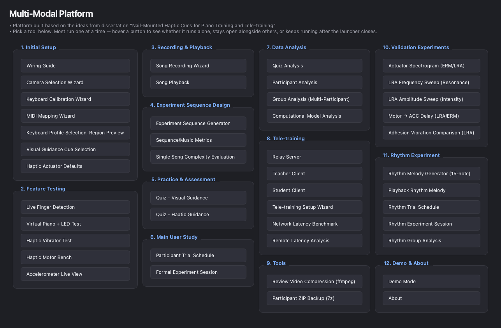

One button per tool, grouped into the numbered sections this manual follows. The grid chooses its own column count to fit your screen, so on a
narrower display you will see fewer columns and a vertical scrollbar rather
than a window running off the edge.

Nothing here holds any hardware itself — it only opens the tool you click.

---

## 1. Initial Setup

Run-once work: wire the rig, tell the platform which camera and keyboard it
has, and pick the cue styles. Everything else in the platform reads what you
set here.

Do them in the order the buttons are listed — the calibration wizard needs a
working camera, and the MIDI mapping wizard needs a calibrated profile.

### 1.1 Wiring Guide

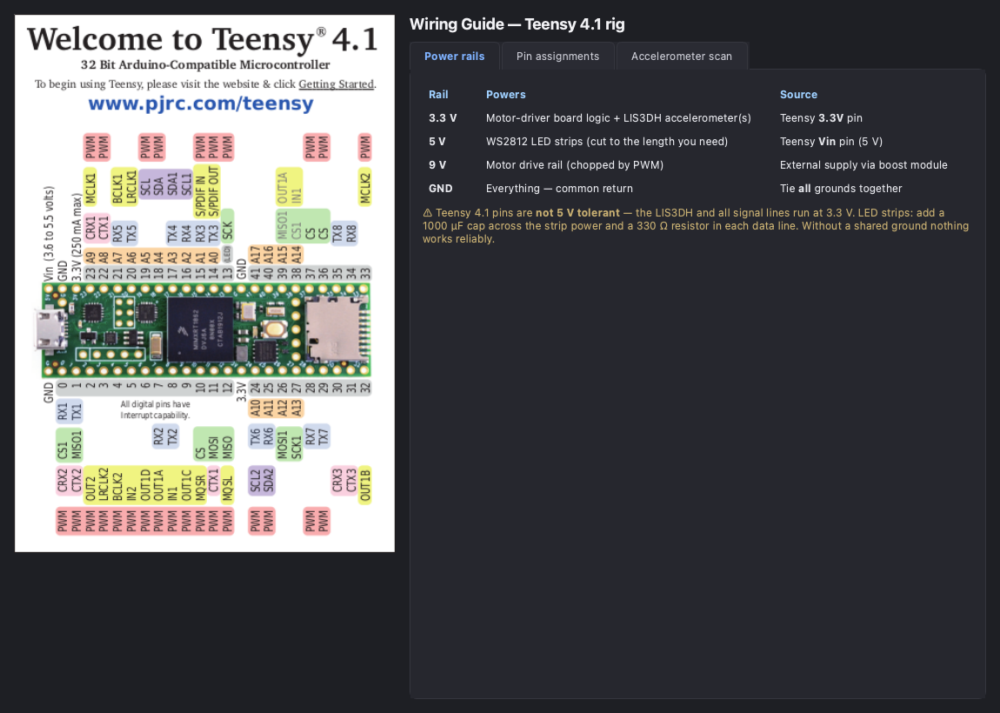

A single reference for wiring the whole rig to the Teensy 4.1: the power
rails, the pin assignments for the finger motors, the two WS2812 LED strips
and the LIS3DH accelerometer bus, next to a labelled board pinout so the pin
numbers map straight onto the physical header. The content mirrors the
*Current Wiring* table in `doc/firmware.md`, which stays the source
of truth.

Three tabs:

| Tab | Contents | |
|---|---|---|
| Power rails | 3.3 V / 5 V / 9 V / GND and what each one feeds | [screenshot](image/wiring_guide_tab1-power-rails.png) |
| Pin assignments | Motor, LED-strip and accelerometer pins on the board diagram | [screenshot](image/wiring_guide_tab2-pin-assignments.png) |
| Accelerometer scan | The one interactive part — see below | [screenshot](image/wiring_guide_tab3-accelerometer-scan.png) |

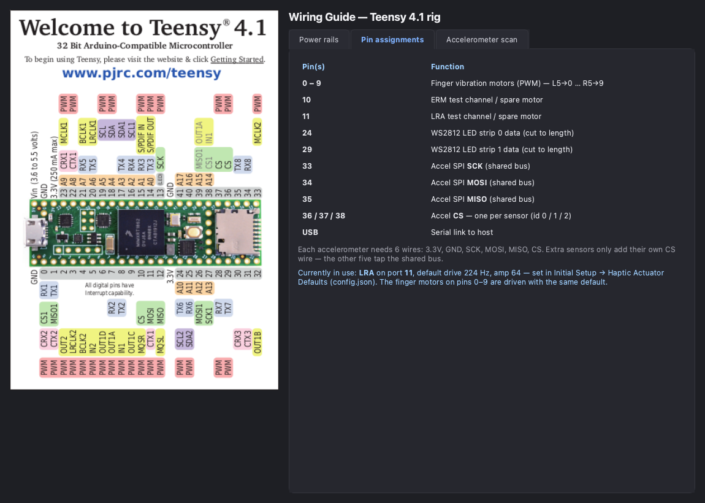

**The accelerometer wiring scan.** The four accelerometer bus wires (SCK /
MOSI / MISO / CS) are easy to swap by accident, and a wrong order just reads
back `0xFF` with no hint which wire is where. Plug the sensor's four wires
onto pins 33/34/35/36 in **any** order and press **A SCAN** (firmware
v2.10.0 or newer): it tries all 24 role permutations and reports the one that
answers `WHO_AM_I = 0x33`.

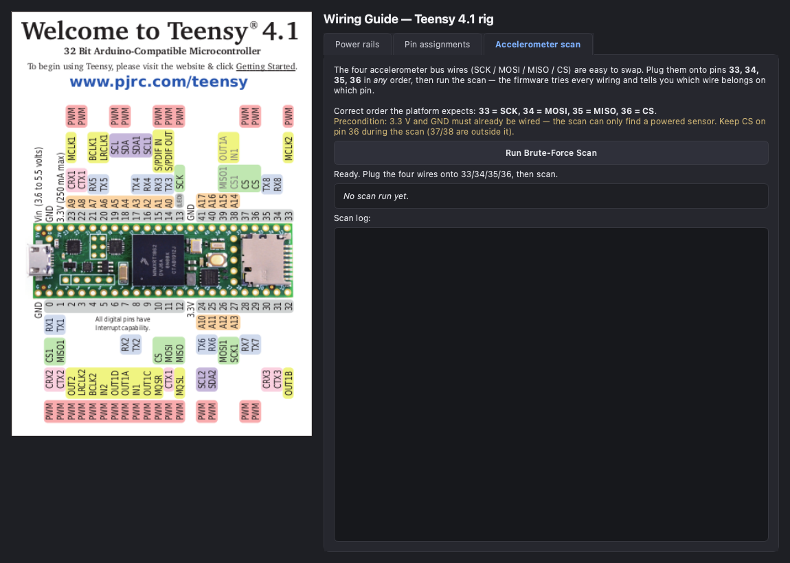

The scan is read-only diagnostics. The firmware restores the normal bus state
when it finishes and never changes the running pin mapping, so the standard
wiring (33 = SCK, 34 = MOSI, 35 = MISO, 36 = CS) stays what the rest of the
platform expects. It only works once 3.3 V and GND are correct, so a
successful scan doubles as proof the sensor is powered.

### 1.2 Camera Selection Wizard

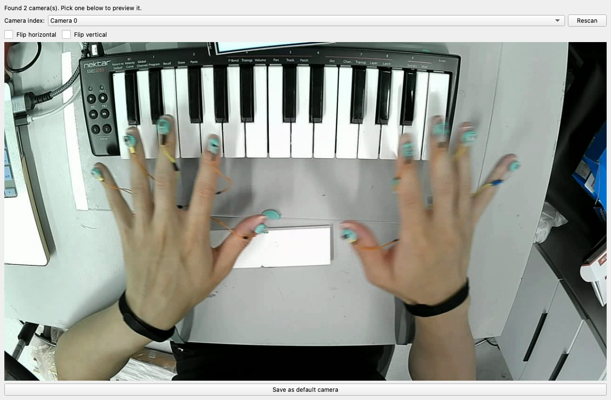

Which camera the platform uses, and which way up its image is.

1. The window scans camera indices on open. Pick one from **Camera index** to
   preview it. **Rescan** re-runs the scan after plugging something in.
2. Tick **Flip horizontal** / **Flip vertical** until the preview matches
   what you see from above the keyboard. Get this right now — every profile
   you calibrate afterwards is a pixel mask of *this* orientation.
3. **Save as default camera** writes the index and both flips to
   `config.json`.

Standalone: `python setup_camera_wizard.py`

### 1.3 Keyboard Calibration Wizard

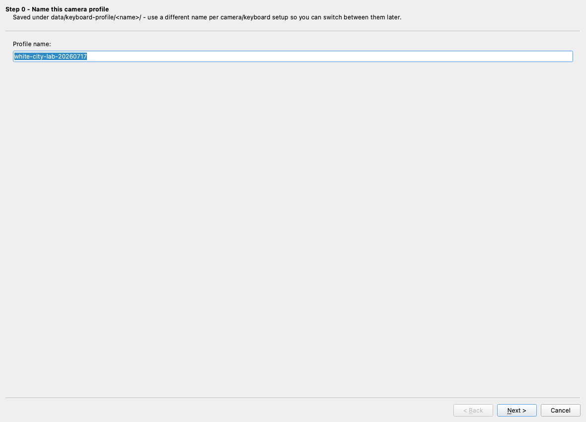

The first of the three FingerAccuracy pipeline stages: mark each piano key's
exact pixel range in the camera image and save it as a **profile**. The
wizard's own steps are numbered from 0 below.

**Step 0 — name the profile.** Saved under `data/keyboard-profile/<name>/`.
Use a different name per camera/keyboard setup so you can switch between them
later.

**Step 1 — capture a photo.** Point the camera at the keyboard and press
**Capture**. Everything after this works on that still frame, not on the live
feed.

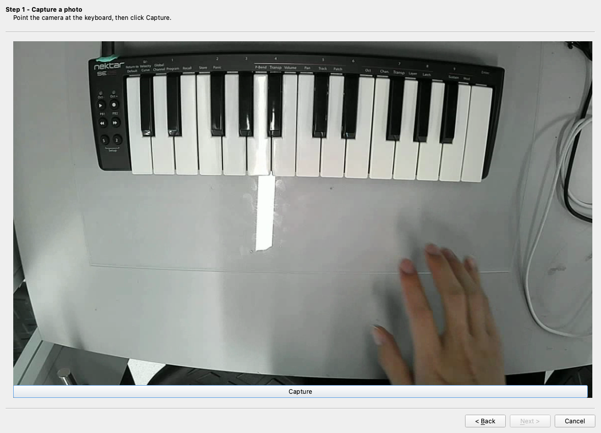

**Step 2 — mark the keyboard boundary.** Click the top-left corner of the
keyboard, then the bottom-right. **Reset points** starts the pair over.

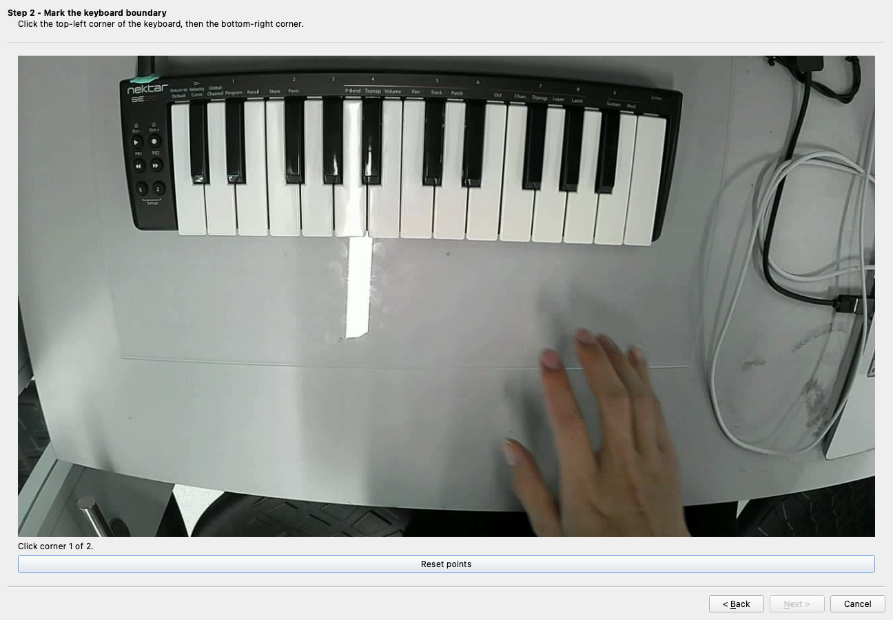

**Remaining steps — fill each key.** You click inside each key and it is
filled paint-bucket style, bounded by Canny edges. The wizard is
mouse-and-buttons only, with no keyboard shortcuts. The result is
`keyboard_template.json` (key ids and white/black kind) plus
`keyboard_key_map.png`, a pixel map whose value at each pixel is that pixel's
key id plus one.

> A profile is only valid while the camera and the keyboard do not move
> relative to each other. Nudge the tripod and every key id shifts silently.
> If that happens, re-run this wizard.

Saving also sets `active_keyboard_profile` in `config.json` — the profile
every other tool uses by default.

Standalone: `python setup_keyboard_wizard.py`

### 1.4 MIDI Mapping Wizard

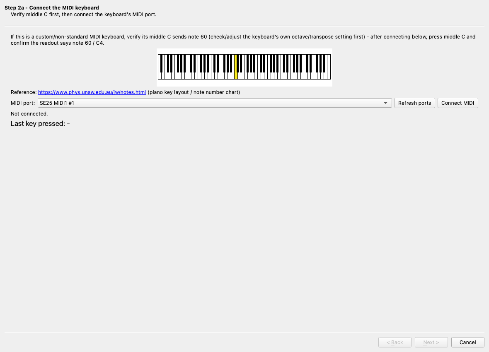

The second pipeline stage: teach the profile which MIDI note number each
calibrated key sends.

**Step 2a — pick the profile and the MIDI port.** Two keyboards of the same
model report the same port name; the pickers disambiguate them as
`SE25 MIDI1 #1` and `SE25 MIDI1 #2`, numbered in the order this machine
enumerated them. That numbering is not a device identity — it can change when
something is replugged.

**Step 2b — press the highlighted key on the physical keyboard, in order.**
The next key to map is highlighted yellow on the calibrated image and the
counter underneath reads `n/25 keys mapped`. Whatever note number the key
actually sends is what gets recorded.

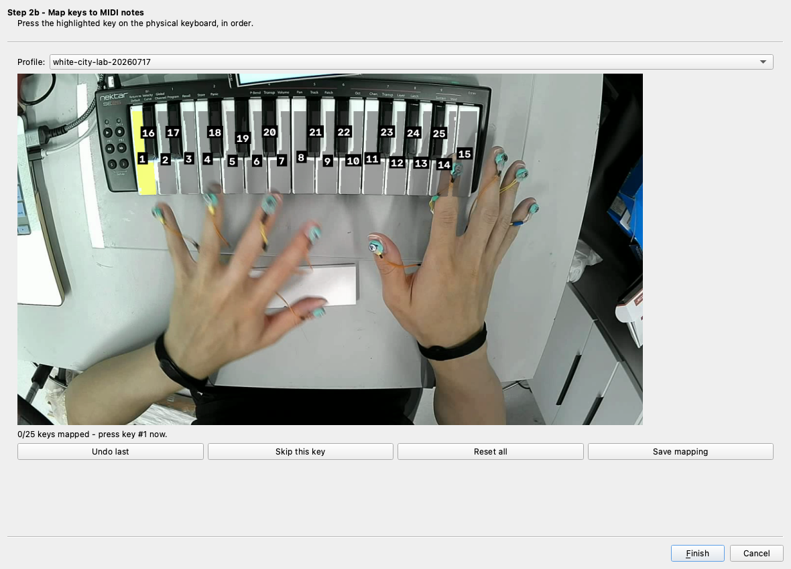

| Button | Use it when |
|---|---|
| **Undo last** | The wrong key was pressed |
| **Skip this key** | That key is not wired, or you do not want it mapped |
| **Reset all** | Start the whole mapping over |
| **Save mapping** | Write `midi_mapping.json` next to the template |

> Can't tell two identical keyboards apart? `python test-script/MIDI.py`
> listens on every port at once and prints which label your key press arrived
> on. On macOS, renaming the instruments in **Audio MIDI Setup → MIDI
> Studio** makes the raw names differ and the `#n` suffixes disappear.

Standalone: `python setup_midi_mapping_wizard.py`

### 1.5 Keyboard Profile Selection, Region Preview

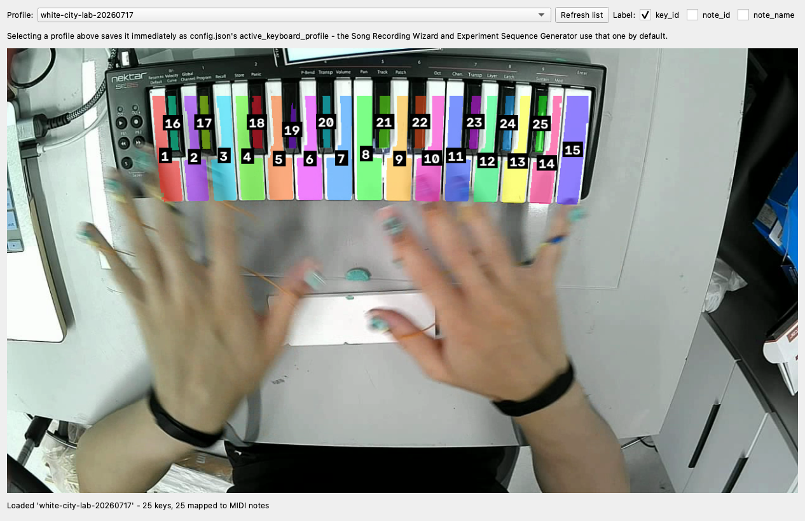

Pick a saved profile from the dropdown and see its key masks drawn on the
live camera feed, with the key id (or the MIDI note name) on each key. No
detection runs here — it just redraws the selected profile's key map every
frame.

This is the sanity check to run whenever you suspect the camera has moved:
if the coloured masks no longer sit on the physical keys, the profile is
stale and the calibration wizard needs re-running.

Standalone: `python test_keyboard_preview.py`

### 1.6 Visual Guidance Cue Selection

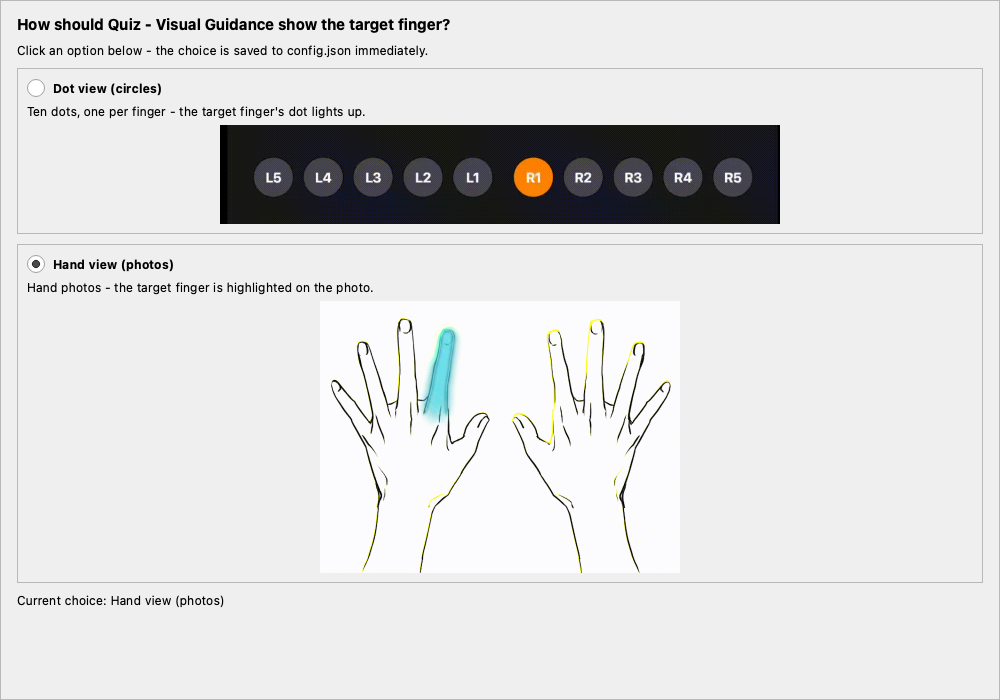

The visual finger cue can be shown as ten **dots** or as highlighted **hand**
photos. This window is the one place that choice is made: it plays both demo
animations stacked vertically, and clicking either the animation or its radio
button saves that style straight into `config.json`
(`visual_cue_style`).

The quiz then reads the stored value on launch rather than asking every time,
which is why this lives in Initial Setup alongside the other run-once
wizards.

### 1.7 Haptic Actuator Defaults

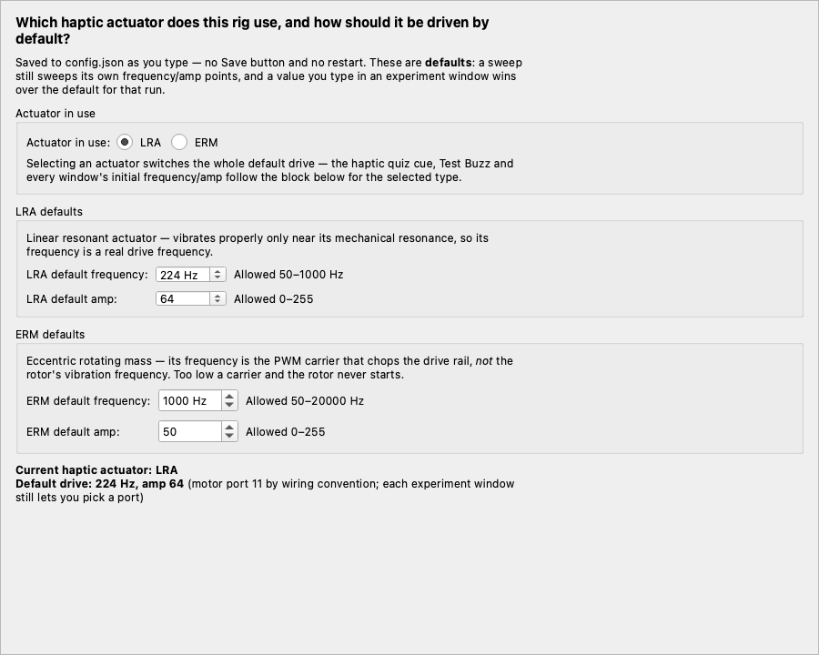

Which vibration actuator the rig drives — and how hard — is **one setting for
the whole project**. No script, window or experiment carries its own copy.

- **Actuator in use**: LRA or ERM. Selecting one switches the whole default
  drive: the haptic quiz cue, Test Buzz, and every window's initial
  frequency/amp follow the block for the selected type.
- **LRA defaults**: frequency 50–1000 Hz, amp 0–255. An LRA's frequency is a
  *real mechanical drive frequency* — it only vibrates properly at or very
  near its resonance, which is what the section 10 sweeps measure.
- **ERM defaults**: frequency 50–20000 Hz, amp 0–255. An ERM's frequency is
  the **PWM carrier** that chops the drive rail, *not* the rotor's vibration
  frequency. Too low a carrier and the rotor never starts.

Changes save to `config.json` as you type — there is no Save button and no
restart. These are **defaults**: a sweep still sweeps its own frequency/amp
points, and a value you type into an experiment window wins for that run.

---

## 2. Feature Testing

Prove each piece of the rig works on its own, before you rely on it in a
session. Nothing here writes experiment data.

### 2.1 Live Finger Detection

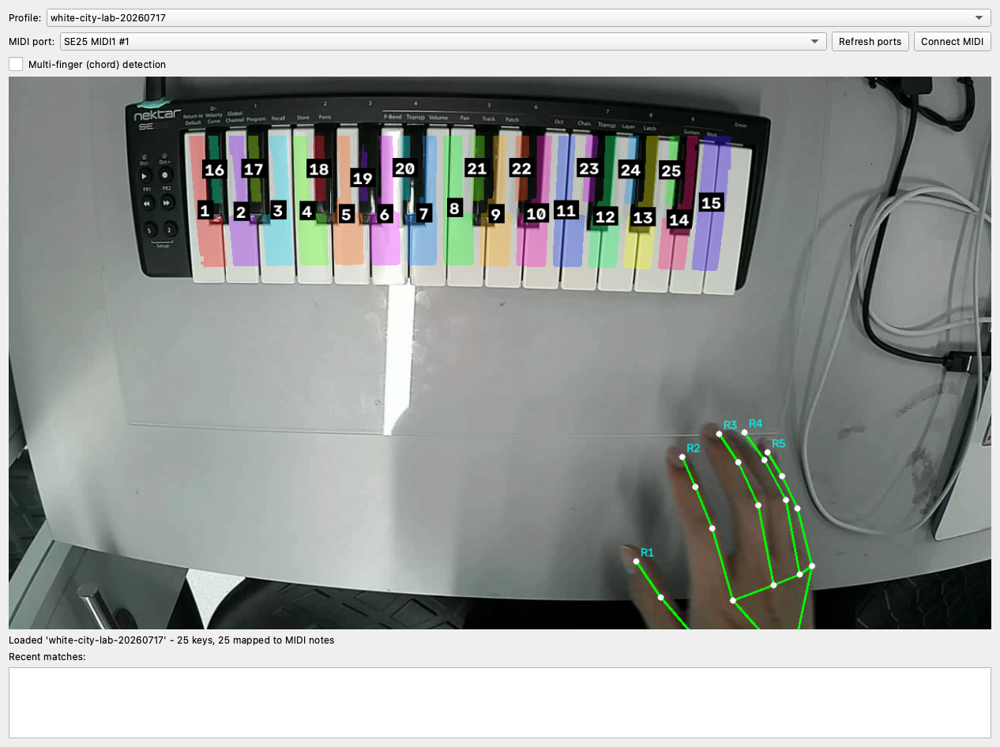

The full FingerAccuracy pipeline running live: the calibrated key masks and
key ids drawn over the camera image, MediaPipe's hand skeleton with each
fingertip labelled `L1`–`L5` (left thumb → pinky) and `R1`–`R5` (right thumb
→ pinky), and real-time matching of every MIDI note-on to the fingertip that
pressed it.

1. Pick the **Profile**.
2. Pick the **MIDI port** and press **Connect MIDI** (**Refresh ports** if
   you plugged in after opening the window).
3. Play. Each note-on appears in **Recent matches** as the key it hit and the
   finger that hit it.

**Multi-finger (chord) detection** changes what happens when several notes
fire in the same instant: with it on, they are matched together so no two
notes can be credited to the same fingertip.

Works with zero, one or two hands in frame. This is the quickest way to
confirm a profile is still aligned and the finger judgement is sane.

Standalone: `python test_finger_accuracy.py`

### 2.2 Virtual Piano + LED Test

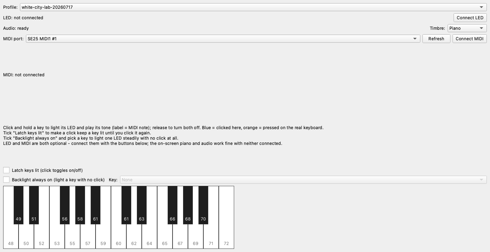

An on-screen piano that mirrors the calibrated profile, for checking the
physical LED strips without reading code.

- **Click and hold** a key → the matching LED(s) on the real strips light up
  and the tone plays; release and both stop. Blue = clicked here, orange =
  pressed on the real keyboard.
- **Latch keys lit** makes a click keep a key lit until you click it again.
- **Backlight always on** plus a **Key** selection lights one LED steadily
  with no click at all — this is what Demo Mode uses to photograph the
  backlight.
- **Connect LED** and **Connect MIDI** are deliberately manual buttons, not
  auto-connect: the window is meant to run against a second rig with no LED
  strip wired at all, so the on-screen piano, the audio and MIDI-driven
  highlighting all keep working with nothing attached.

Standalone: `python test_virtual_piano_led.py`

### 2.3 Haptic Vibrator Test

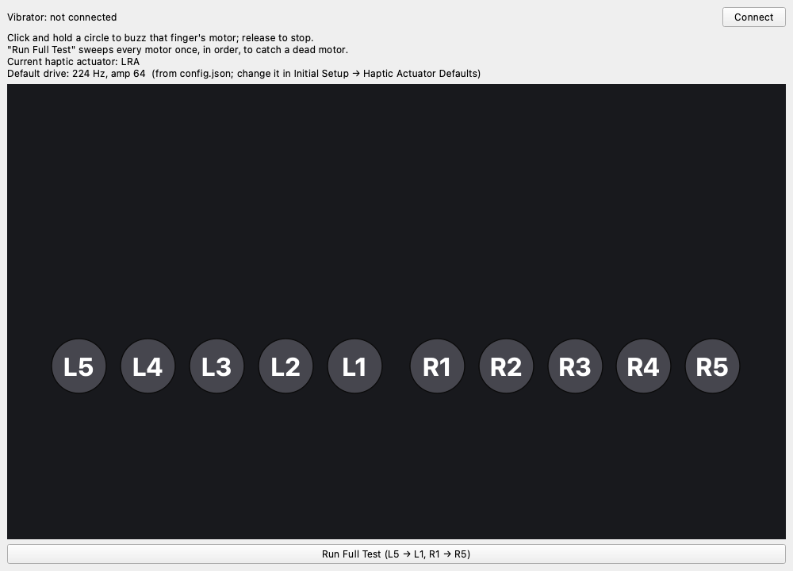

Press **Connect** (top right), then click and hold a labelled circle — `L5`…`L1`,
`R1`…`R5`, the same layout as the haptic quiz's finger cue — to buzz that
finger's motor; release to stop it. **Run Full Test** sweeps every motor once,
`L5 → L1, R1 → R5`, so a dead motor is caught without ten separate clicks.

The header states which actuator is in use and at what drive, so you can see
at a glance that you are feeling the same cue the experiment delivers.

This exercises the *exact same* finger→motor mapping and the *exact same*
drive strength the haptic guidance condition uses: the mapping comes from
`app/haptic_cue.py` and the amp/frequency from `config.json`'s haptic block.
Change the strength in [Haptic Actuator Defaults](#17-haptic-actuator-defaults),
not here.

Standalone: `python test_haptic_vibrator.py`

### 2.4 Haptic Motor Bench

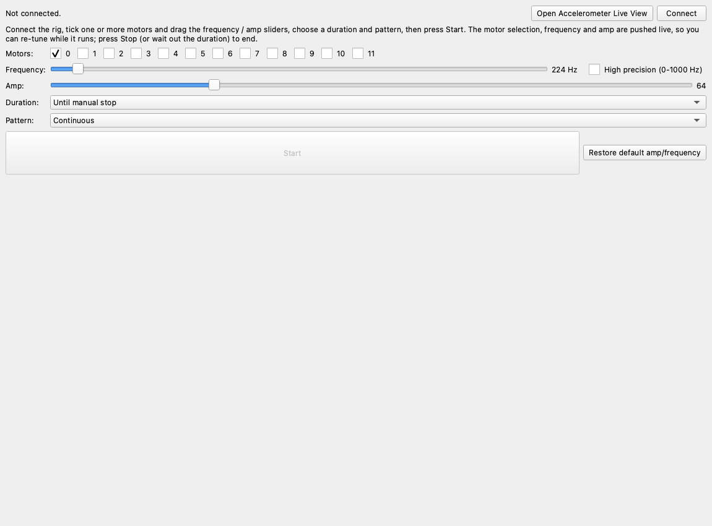

A bench for *feeling* one or several actuators at an arbitrary drive, without
editing a script or running a full sweep — e.g. trying the LRA at its
resonance against the ERM at a kHz carrier, or sanity-checking a wiring
change.

1. Tick one or more **motor ports**.
2. Drag the **frequency** and **amp** sliders. They open on the configured
   default drive for the actuator in use.
3. Choose a **run duration** and a **vibration pattern**, then Start.

Selection, frequency and amp are pushed to the device **live**: while motors
are energised, dragging a slider or ticking a port re-tunes the running set
immediately, so you feel the change without stopping. On disconnect or exit
every retuned port's frequency is reset to the boot default.

Standalone: `python test_haptic_single_motor.py`

### 2.5 Accelerometer Live View

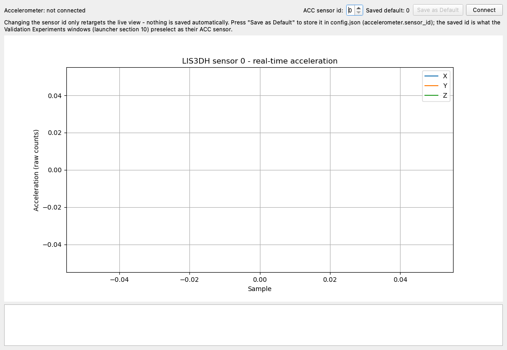

A live X/Y/Z plot of one LIS3DH on the vibration rig, at 100 Hz. Press
**Connect** and the log underneath reports the port it auto-detected, the
firmware identity it handshook with, and the stream starting.

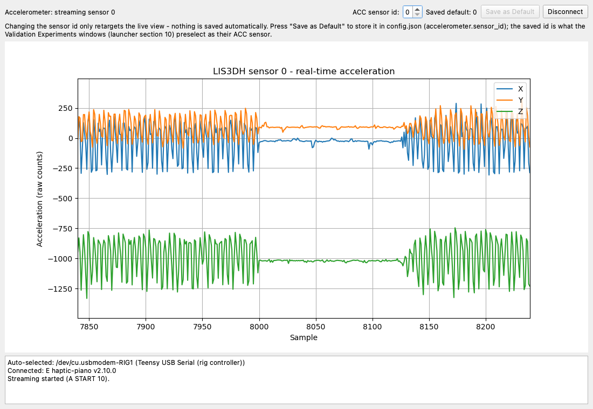

Reading the trace: **Z rests near −1000 counts** because that axis carries
gravity, and the bursts are the actuator driving at the configured default
(224 Hz, amp 64) with the quiet stretch between them the noise floor. That
contrast is what the window is for — if a burst does not stand clear of the
floor, the sensor is not coupled to the motor and every measurement in
section 10 would be worthless.

The stream carries every sensor interleaved, so the **sensor id** selector
switches which one you are watching live, with no restart.

Changing the selector only retargets the view. Nothing is written until you
press **Save as Default**, which stores the id in `config.json`
(`accelerometer.sensor_id`) — the sensor the section 10 sweep windows
preselect. The currently saved id is shown next to the selector so the two
states cannot be confused.

---

## 3. Recording & Playback

### 3.1 Song Recording Wizard

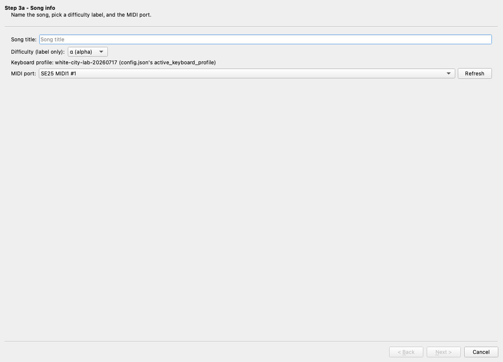

A teacher plays a song once; the wizard records the video and the MIDI
together, flashes the LEDs for sync, and saves a fingering-annotated score
under `data/music/<song>/`.

**Step 3a — song info.** Name the song, pick a difficulty label (a label
only — it does not change anything the wizard does) and choose the MIDI port.
The keyboard profile is not a choice here: it is always `config.json`'s
`active_keyboard_profile`, shown so you can confirm it.

**Step 3b — record.** Watch the camera preview, play the song, stop when
done. Video and MIDI are captured together and the LEDs flash once so the two
can be aligned afterwards.

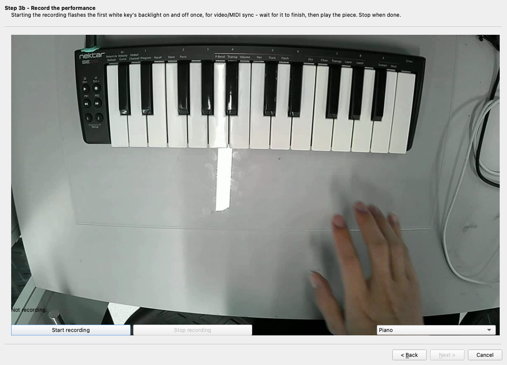

**Step 3c — review & save.** **Compute fingering & save** runs the detection
over the recording so every note carries the finger that played it
(`fingering.json`), then writes the song. That fingering is what the quizzes
cue against.

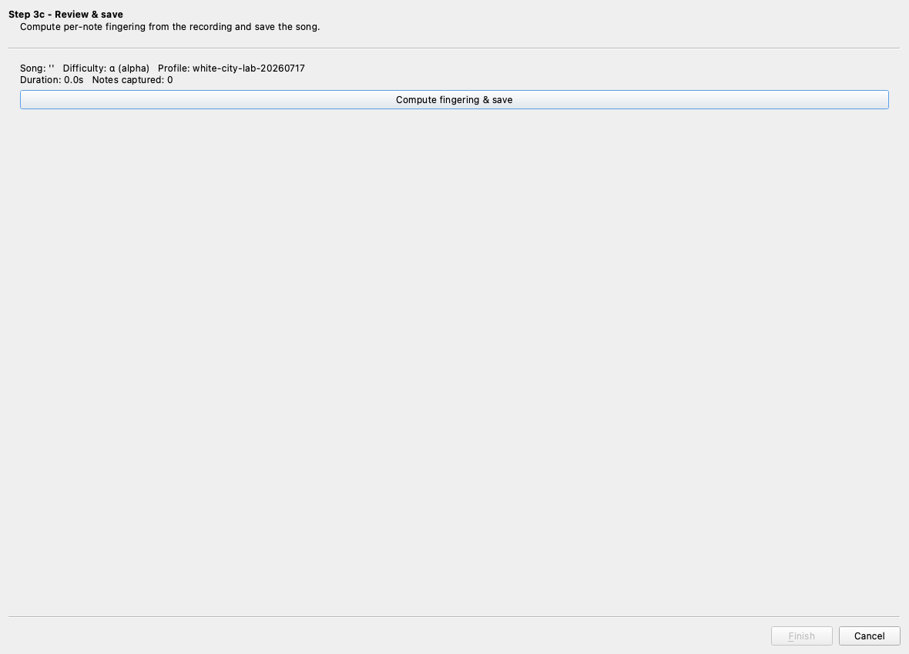

Standalone: `python music_recording_wizard.py`

### 3.2 Song Playback

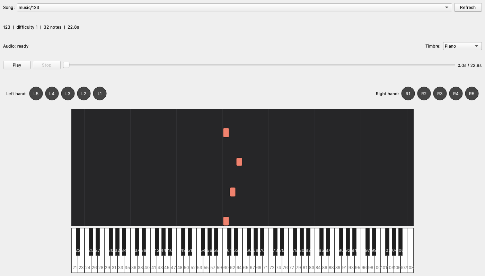

Replays a saved song on an on-screen **88-key** piano, highlighting each key
as it is pressed and lighting a dot for whichever finger (`L1`–`L5` /
`R1`–`R5`) played it.

No camera, MIDI device or LED strip is needed — this only reads back files
that are already saved. The keyboard is a full A0–C8 piano rather than the
~25 keys the recording keyboard physically has, because this is a pure
display.

Standalone: `python music_playback.py`

---

## 4. Experiment Sequence Design

The stimuli for the Main User Study. The algorithm — the difficulty
components, the hand regions, the matching tolerances — is written up in
[`doc/SEQUENCE_GENERATOR_ALGORITHM.md`](SEQUENCE_GENERATOR_ALGORITHM.md); this
section is only how to drive the windows.

### 4.1 Experiment Sequence Generator

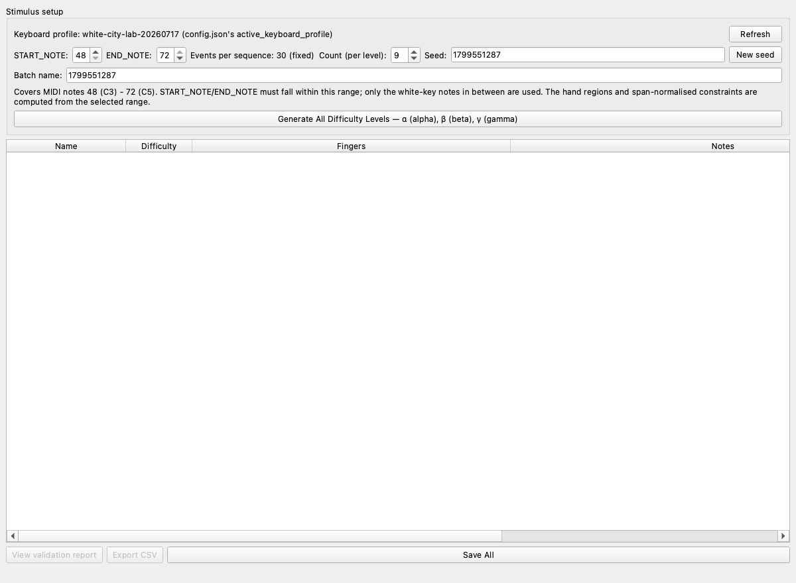

Builds a matched family of 30-event bimanual sequences for **every**
difficulty level at once — α (alpha), β (beta), γ (gamma). There is no level
picker, because a stimulus set always needs all three.

1. Check the header: the keyboard profile is always `config.json`'s
   `active_keyboard_profile`, so a sequence can never be generated against
   the wrong physical keyboard.
2. Set **START_NOTE** / **END_NOTE**. These are real MIDI note numbers,
   bounded by what that profile's `midi_mapping.json` actually covers; only
   the white-key notes in between are used. Hand regions and the
   span-normalised constraints are computed from the range you choose.
3. Set **Count (per level)** — the family size, default 9. Every sequence in a
   level's family is named `<level symbol>-<id>`, e.g. `α-1`…`α-9`.
4. Set the **Seed** (or press **New seed**) and a **Batch name**. The seed is
   what makes a batch reproducible.
5. **Generate All Difficulty Levels**.

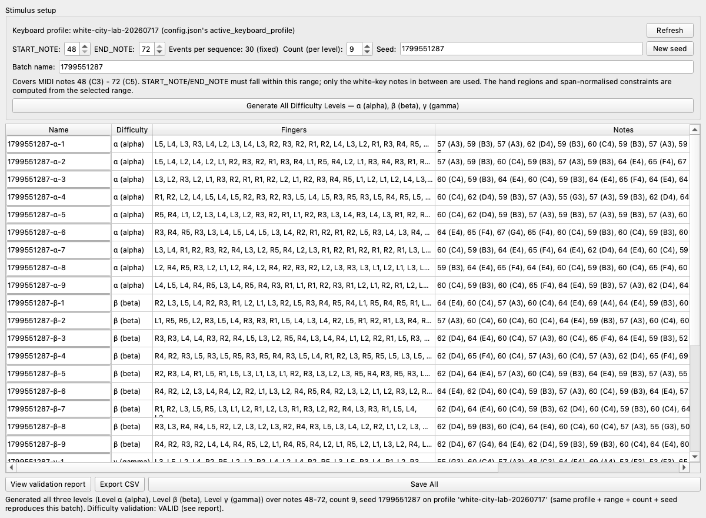

One row per generated sequence: its name, difficulty level, the fingering and
the notes, with the family-matching statistics further right (the table scrolls
horizontally). The status line underneath restates exactly what would reproduce
the batch — same profile, range, count and seed — and the verdict of the
difficulty validation, which runs automatically after every generation.

**View validation report** opens that validation in full, **Export CSV** writes
the table, and **Save All** writes the batch to `data/sequence/<batch>/`.

Standalone: `python experiment_sequence_wizard.py`

### 4.2 Sequence/Music Metrics

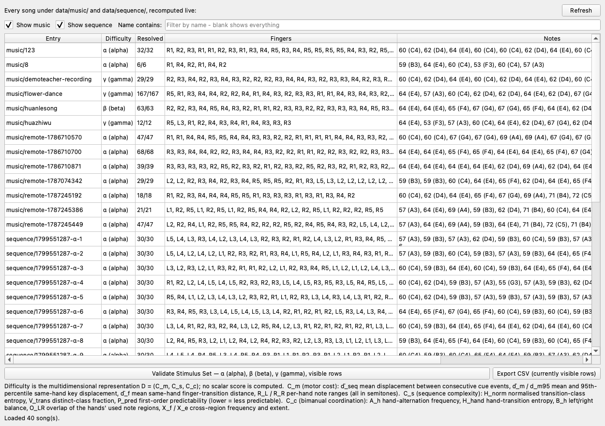

A read-only viewer over what is already saved: **every** song under
`data/music/` and every sequence under `data/sequence/`, in one table,
recomputed live by the exact same functions the generator uses. Use it to
compare one batch against another, or a recorded song against the generated
families.

**Show music** / **Show sequence** and the **Name contains** filter narrow the
list. The **Resolved** column is how many of that entry's events have a
resolved fingering. The legend underneath spells out the difficulty
representation the columns come from, and **Validate Stimulus Set** re-runs the
difficulty validation over whichever rows are currently visible.
**Export CSV** writes those same visible rows.

### 4.3 Single Song Complexity Evaluation

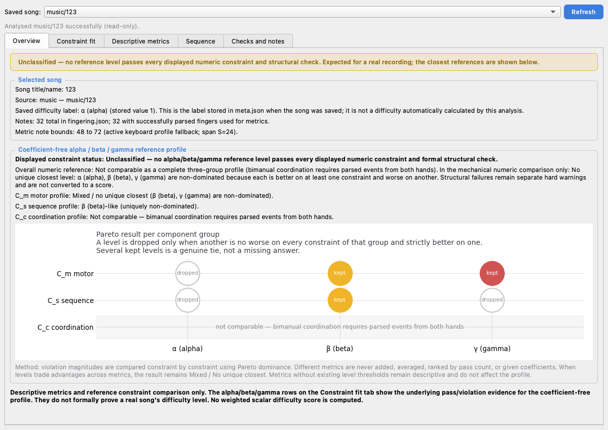

The same measures for **one** saved song, laid out over five tabs:

| Tab | Shows | |
|---|---|---|
| Overview | The headline complexity figures for this song | [screenshot](image/single_song_metrics_tab1-overview.png) |
| Constraint fit | How the song sits against the generator's reference constraints | [screenshot](image/single_song_metrics_tab2-constraint-fit.png) |
| Descriptive metrics | The component-by-component breakdown | [screenshot](image/single_song_metrics_tab3-descriptive-metrics.png) |
| Sequence | The note/finger sequence itself | [screenshot](image/single_song_metrics_tab4-sequence.png) |
| Checks and notes | What was and was not verifiable for this song | [screenshot](image/single_song_metrics_tab5-checks-and-notes.png) |

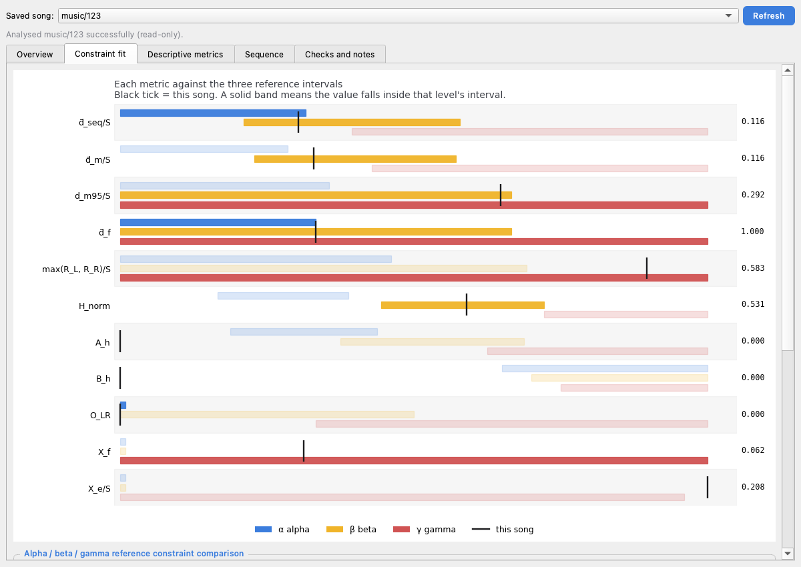

---

## 5. Practice & Assessment

One cue-response quiz over a saved song or generated sequence. The two
buttons open the *same* window with a different finger cue — everything else
(LED key cueing, the timeout countdown, the recording, the analysis) is
identical.

### 5.1 Quiz — Visual Guidance

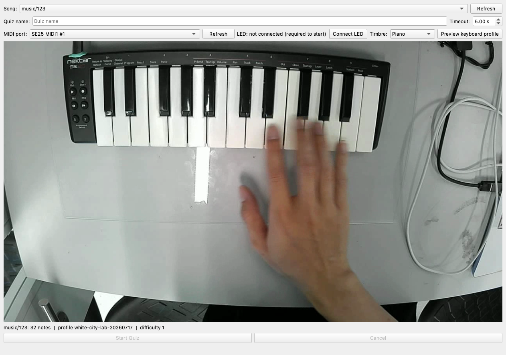

1. Pick the **Song** (a recorded song or a generated sequence) and give this
   attempt a **Quiz name**.
2. Pick the **MIDI port**, the **Timbre** and the **Timeout** per event.
3. Press **Connect LED** — a connected strip is required to start.
4. Press **Preview keyboard profile** to confirm the camera still matches the
   calibration. It draws the active profile's key masks and ids over the
   frame already on screen; nothing is saved, and the button is disabled
   while recording.
5. **Start Quiz**.

Per event: the target key's LED lights and the cue window says which finger
to use. The cue window is a separate window — drag it to the participant's
display and fullscreen it.

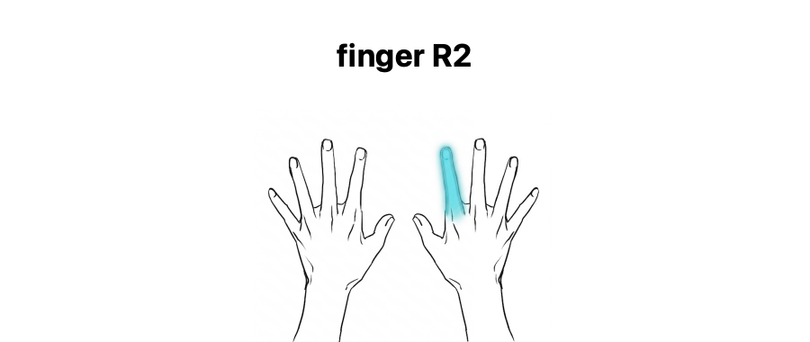

The whole session's video and MIDI are recorded to `data/quiz/<quiz name>/raw/`
throughout, and afterwards the finger detection is run once over the
recording. The results — key accuracy, timing error, finger accuracy and a
per-note breakdown — are saved alongside.

Standalone: `python student_quiz.py`

### 5.2 Quiz — Haptic Guidance

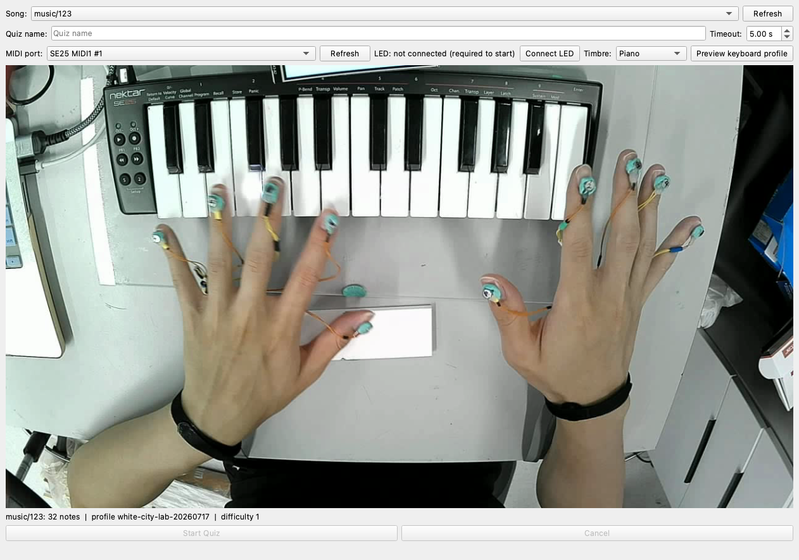

Identical to the above, except the finger is conveyed by a vibration motor on
that finger's nail instead of the on-screen cue. Same drive strength as
[Haptic Vibrator Test](#23-haptic-vibrator-test), from `config.json`'s haptic
block.

Standalone: `python student_quiz_haptic.py`

---

## 6. Main User Study

The formal experiment. These two windows have no standalone entry scripts —
open them from the launcher.

The three feedback conditions are **A** key-light only, **B** visual finger
cue, **C** vibrotactile finger cue.

### 6.1 Participant Trial Schedule

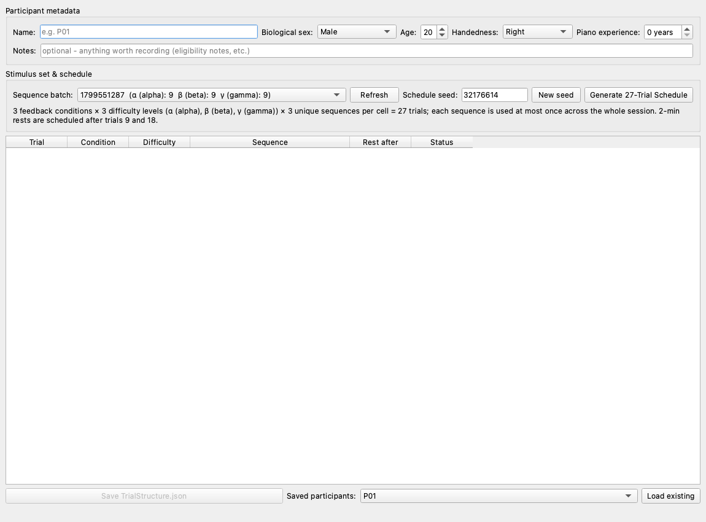

Builds and saves one participant's randomised 27-trial schedule.

1. Fill in the **participant metadata**: name/ID, biological sex, age,
   handedness, piano experience, and any notes.
2. Pick the **Sequence batch** — this locks the participant to one generated
   batch under `data/sequence/`.
3. Set the **Schedule seed** (or press **New seed**), then **Generate 27-Trial
   Schedule**.

3 feedback conditions × 3 difficulty levels × 3 unique sequences per cell =
27 trials; each sequence is used at most once across the whole session, and
2-minute rests are scheduled after trials 9 and 18.

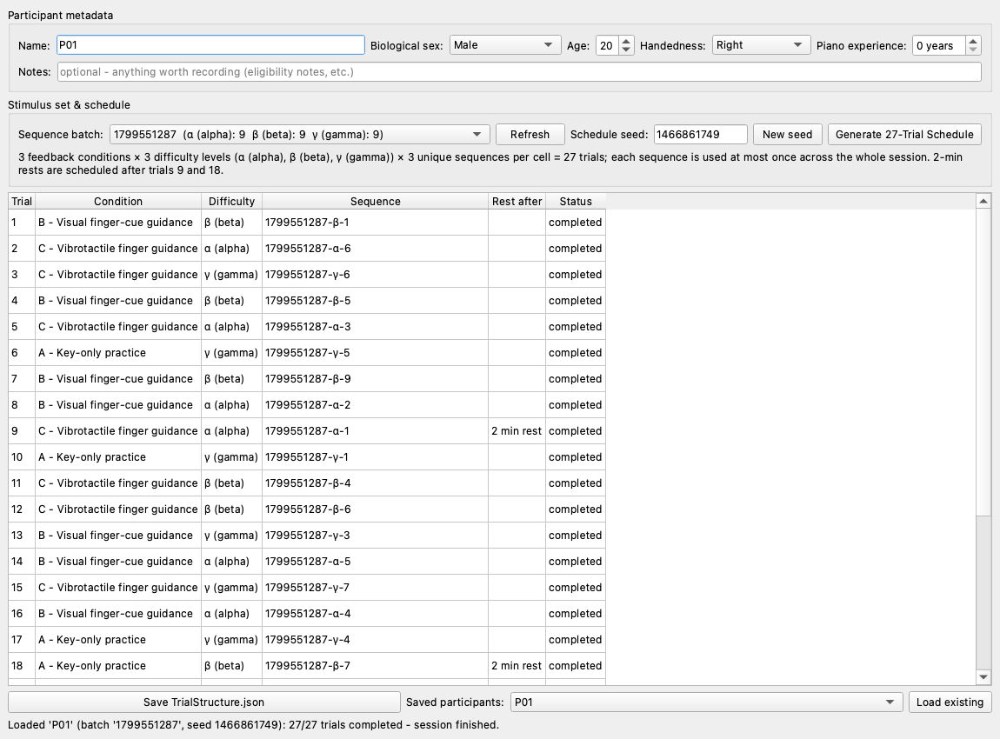

**Save TrialStructure.json** writes it to
`data/MainUserStudy/<participant>/TrialStructure.json`. **Load existing** with
a participant selected reopens a schedule you already made.

### 6.2 Formal Experiment Session

This button opens **three windows at once**.

**1 — Session controller.**

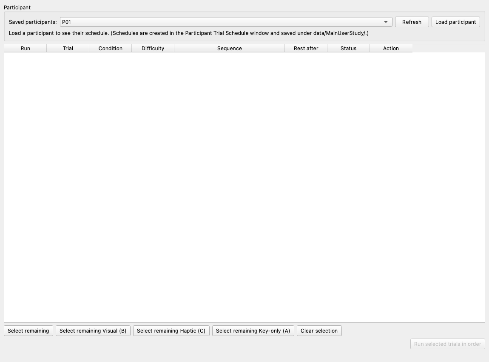

**Load participant** brings in a saved `TrialStructure.json` and the table
shows every trial's live status. Each row has a tick box and its own **Start**
button. The shortcut buttons tick the remaining trials of one condition
("Select remaining Visual (B)", and so on), and **Run selected trials in
order** walks the ticked trials smallest-index-first, pausing for a manual
Continue between trials — with the 2-minute rest countdown after trials 9 and
18.

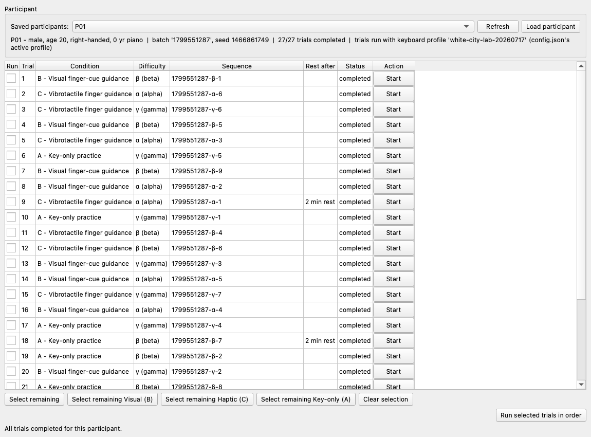

Every status change is written straight back to `TrialStructure.json`, so a
crashed session reloads with its exact progress and resumes from the first
non-completed trial.

**2 — Trial runner.**

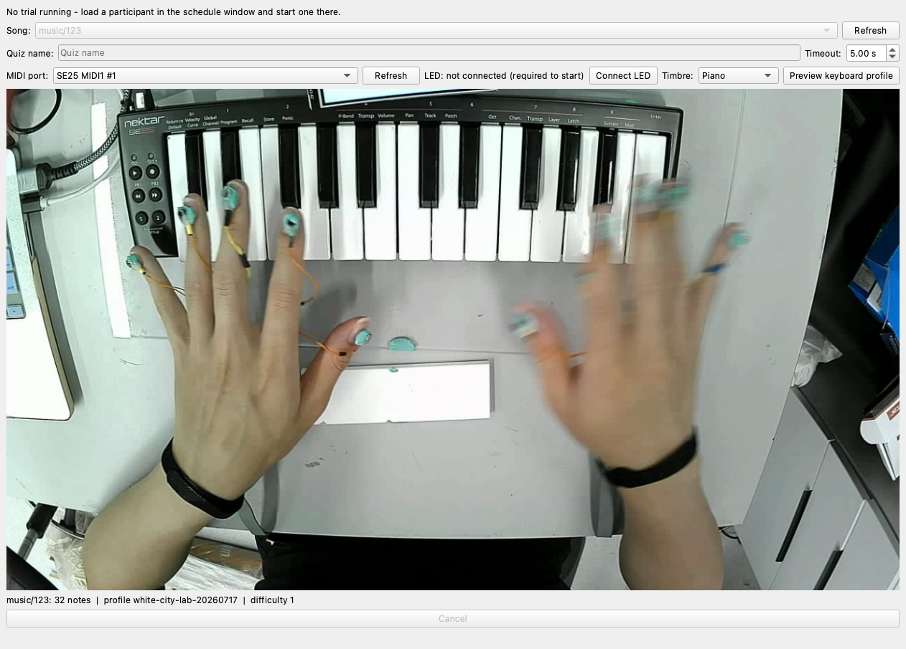

The quiz window re-purposed for scheduled trials. Connect the LED strip and
pick the MIDI port, timbre and timeout **here, once** for the session, and use
**Preview keyboard profile** to confirm the camera still matches the
calibration before the first trial. The song and quiz-name fields are driven
by the schedule, not by you.

Every trial records an ordinary quiz under `data/quiz/`, named
`<participant>-T<index>-<condition><level>` — a rerun appends `-r2`, `-r3`, …
so no attempt's data is ever overwritten. That means the section 7 analysis
tools work on study trials unchanged. The per-trial analysis popup is
suppressed mid-session; batch the analysis afterwards.

**3 — Participant-facing cue screen.**

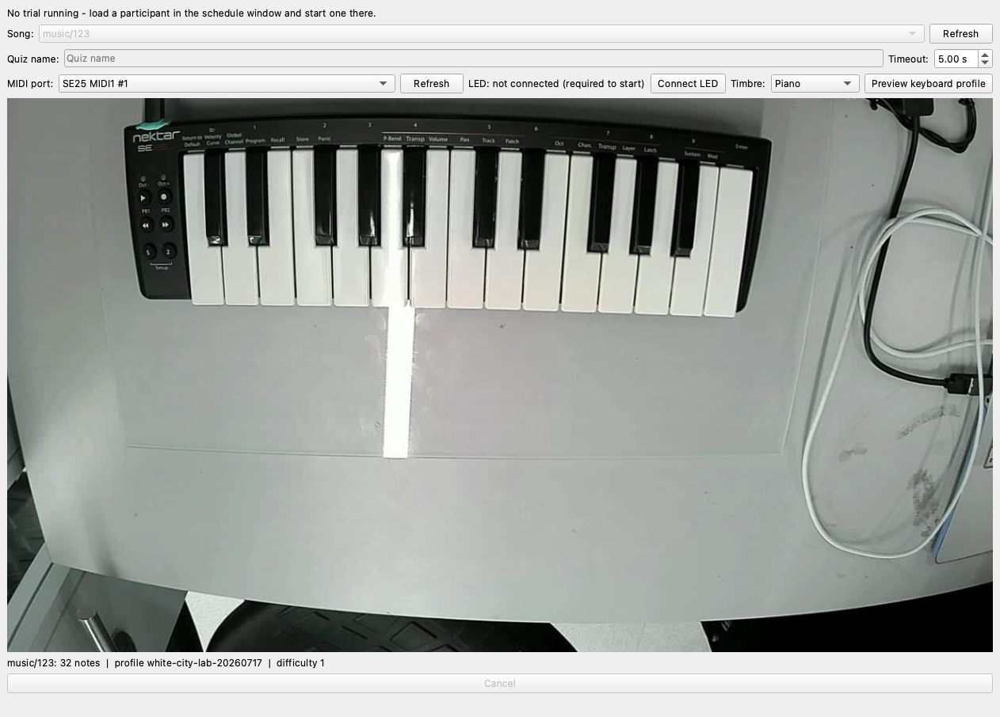

Created once per session, so you drag it onto the external display and
fullscreen it **one time** instead of reopening it every trial. Condition B
draws the visual finger cue on it; conditions A and C show only a status line,
so no visual finger cue can leak into them.

> Trials always run with `config.json`'s `active_keyboard_profile`. The
> `keyboard_profile` stored inside `TrialStructure.json` is *not* used at run
> time — it only records which profile limited the generator's key range when
> the schedule was made.

---

## 7. Data Analysis

The workflow is a pipeline, and the buttons are in the order you use them:
score the trials, export the participant, then analyse one participant, the
group, and finally the model.

Every stored time in the codebase is an absolute Unix epoch timestamp — no
ISO strings and no recorder-relative clocks.

### 7.1 Quiz Analysis

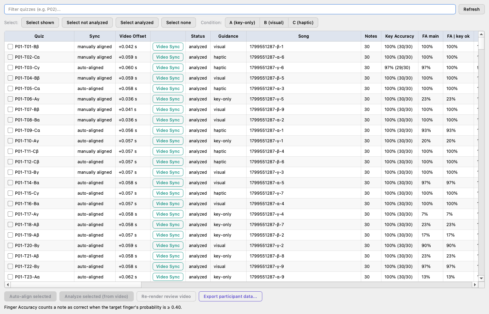

The per-trial hub. Every saved quiz is a row in a checkable table, with the
full outcome measures as columns: key accuracy, the three finger-accuracy
views (FA main = key ∧ finger over all events, the primary measure; FA | key
ok; Note Accuracy | finger ok), stratified reaction times, timeout and
wrong-key counts, the carry-over review state, QC extra-press counts,
same-hand vs hand-switch splits, per-finger FA/TE for `L1`–`L5` / `R1`–`R5`,
and FA under alternative thresholds.

Use the filter box plus **Select shown / not analyzed / analyzed / none**, and
the **A (key-only) / B (visual) / C (haptic)** buttons, to pick a working set.

The leftmost columns are the ones to read first: **Sync** says whether that
trial's LED anchor was auto- or manually aligned, and **Video Offset** is the
offset it settled on. The table scrolls right through the rest of the measures,
and the line under it states the finger-accuracy threshold the percentages
were counted at.

**What each button does**

| Button | Effect |
|---|---|
| **Video Sync** (per row) | Opens a 3-frame manual alignment window for a trial whose LED flash the detector could not handle. A saved — especially manual — alignment always wins over re-detection. |
| **Auto-align selected** | Persists fresh LED-flash detections as `sync_align.json`, skipping anything already aligned. Behind a confirmation. |
| **Analyze selected (from video)** | Re-runs the detection pipeline and the review-video render per checked quiz. **Behind a confirmation, because it overwrites the detected-finger fields** — manual finger corrections are lost; carry-over validity verdicts are kept. |
| **Re-render review video** | Rebuilds the review copy without re-detecting. |
| **Export participant data…** | Writes `<P>_trials.csv` / `<P>_events.csv` next to that participant's `TrialStructure.json`. |

#### Quiz Detail — one trial, event by event

**Double-click a quiz row** to open it.

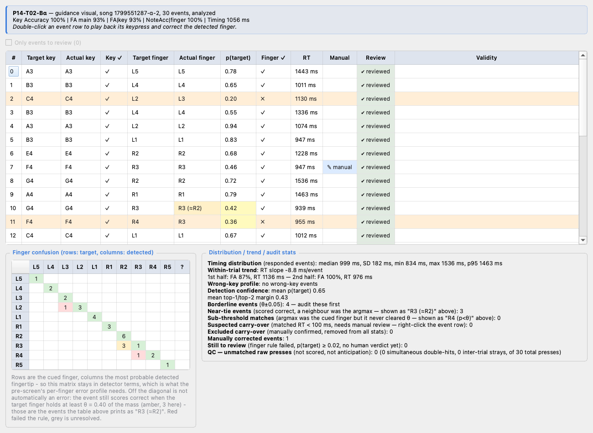

Every event of the trial as its own row: the cued key and finger against what
was actually pressed and detected, the detector's confidence `p(target)`, the
reaction time, and whether a human has ruled on it.

**The colours are the whole point of the window** — they say which events
deserve your attention, so you are not reading thirty rows evenly:

| Row / cell | Means |
|---|---|
| Amber row, red ✗ in **Finger ✓** | The finger rule failed: the cued finger never held enough of the probability mass. |
| Yellow `p(target)`, e.g. `R3 (≈R2)` in **Actual finger** | A **near-tie** — scored correct, but a neighbouring finger was the most probable one. Worth a look. |
| `R4 (p<θ)` | A **sub-threshold match**: the cued finger *was* the most probable, but never cleared θ. |
| `✎ manual` in **Manual** | A human has already corrected this event's finger. |
| `review!` in **Validity** | A suspected carry-over — see below. |
| `✔ reviewed` in **Review** | Someone has ruled on it; it is off the review queue. |

**Only events to review** at the top collapses the table to what is still
outstanding, and its count is the size of the job.

Underneath, the **finger confusion matrix** (rows = cued finger, columns =
most probable detected fingertip) shows the trial's error *structure* rather
than its rate, and the **distribution / trend / audit stats** panel names
every count the table's colours encode — borderline events, near-ties,
sub-threshold matches, carry-over suspects, manual corrections, and the QC
tally of raw presses that never matched an event.

> Off the diagonal is **not** automatically an error. An event still scores
> correct while the cued finger holds at least θ = 0.40 of the mass — those
> are the amber `R3 (≈R2)` rows. Red failed the rule; grey is unresolved.

#### Event Review — watch one keypress

**Double-click an event row** in the detail window.

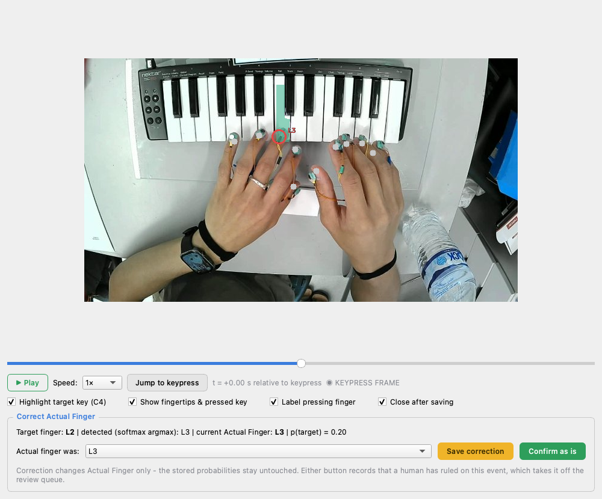

The recording around that keypress, ±5 s, so you can see for yourself which
finger pressed the key. The target key is tinted, every tracked fingertip is
dotted, and the finger the detector chose is circled and labelled.

- **Play** / **Speed** / the scrubber move through the clip; **Jump to
  keypress** returns to the moment itself, marked `KEYPRESS FRAME`.
- The four tick boxes turn each overlay off, for when an overlay is covering
  the thing you are trying to see.
- **Correct Actual Finger** states the disagreement in one line — cued finger,
  what the detector chose, and how much probability the cued finger got — then
  lets you set what actually happened.

**Save correction** records a different finger; **Confirm as is** agrees with
the detector. Either one counts as a human verdict and takes the event off the
review queue. A correction changes `actual_finger` **only** — the stored
probabilities are never rewritten, so the detector's original opinion survives
as the audit trail.

#### Carry-over review

A matched response faster than 100 ms cannot be a reaction to its cue — in
practice these are the tail of the previous event's presses crossing the gap.
Such events are flagged `review!` in the Validity column and are **never**
auto-labelled: only a human sets validity, and the code merely nominates
suspects.

**Right-click the event row** for the verdict. The menu offers *Confirm as
invalid carry-over (exclude from RT & accuracy)*, or, on an event already
excluded, *Restore event (mark valid again)*. A confirmed carry-over is
dropped from every statistic — reaction time and accuracy alike — and
re-counted as `excluded_carryover`. Timed-out events have no matched response,
so there is nothing to rule on and no menu appears.

Excluding an event moves every headline number for the trial, so the window
rewrites `results.json` and re-derives the cached summary in the same step.

> **Export is the hand-off.** Group Analysis reads the exported CSVs, not
> `results.json`. Re-run **Export participant data** after any round of finger
> corrections or carry-over verdicts, or the group numbers will be stale.

Standalone: `python quiz_analysis.py`

### 7.2 Participant Analysis

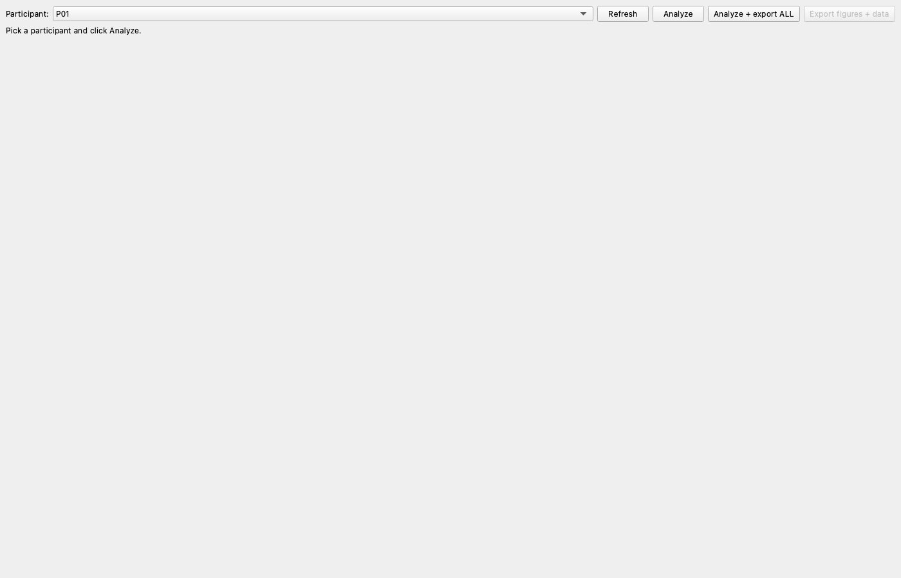

Pick a participant and press **Analyze**. Everything here is within-subject
and descriptive — group-level inference is the next window.

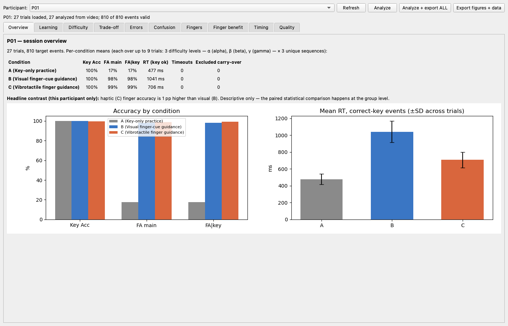

Ten tabs:

| Tab | Question it answers | |
|---|---|---|
| Overview | The headline per-condition means, side by side | [screenshot](image/participant_analysis_tab1-overview.png) |
| Learning | Progression across the session and the trial 1→3 trend within each condition-level cell | [screenshot](image/participant_analysis_tab2-learning.png) |
| Difficulty | How α / β / γ compare | [screenshot](image/participant_analysis_tab3-difficulty.png) |
| Trade-off | Speed against accuracy | [screenshot](image/participant_analysis_tab4-trade-off.png) |
| Errors | Event-level error breakdown and wrong-key distance | [screenshot](image/participant_analysis_tab5-errors.png) |
| Confusion | Per-condition finger confusion matrices | [screenshot](image/participant_analysis_tab6-confusion.png) |
| Fingers | Per-finger profiles, by physical finger and by homologous finger id | [screenshot](image/participant_analysis_tab7-fingers.png) |
| Finger benefit | The per-finger benefit of the haptic cue | [screenshot](image/participant_analysis_tab8-finger-benefit.png) |
| Timing | Reaction-time distributions | [screenshot](image/participant_analysis_tab9-timing.png) |
| Quality | The data-quality audit, including the carry-over counters | [screenshot](image/participant_analysis_tab10-quality.png) |

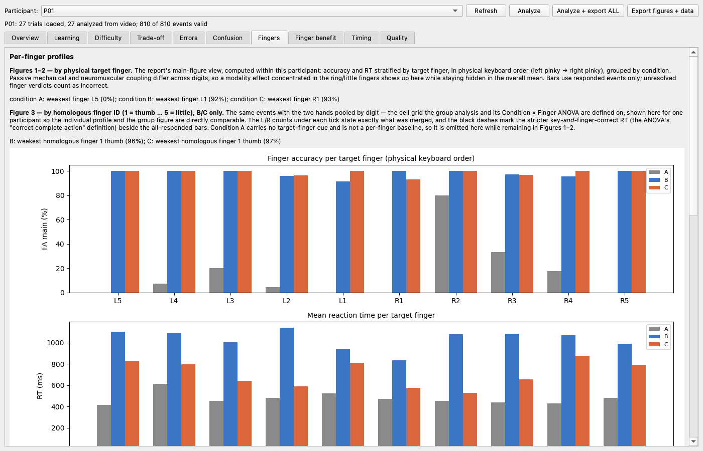

Each tab carries an auto-generated caption. **Export figures + data** writes
300 dpi PNGs and tidy CSVs under `data/MainUserStudy/<P>/figures/`;
**Analyze + export ALL** does every participant in one pass.

### 7.3 Group Analysis (Multi-Participant)

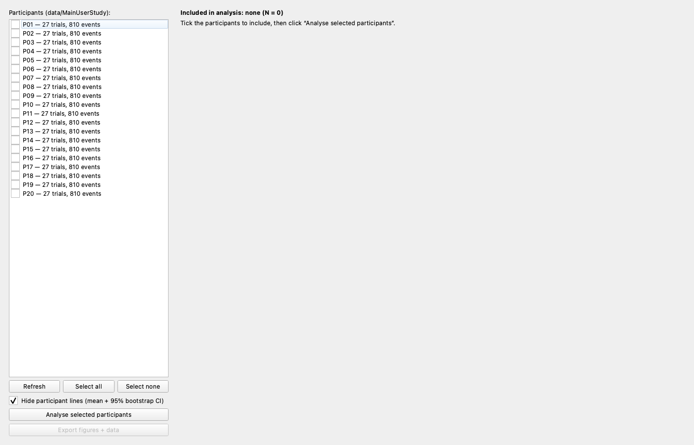

Tick any subset of exported participants (**Select all** / **Select none**),
then **Analyse selected participants**.

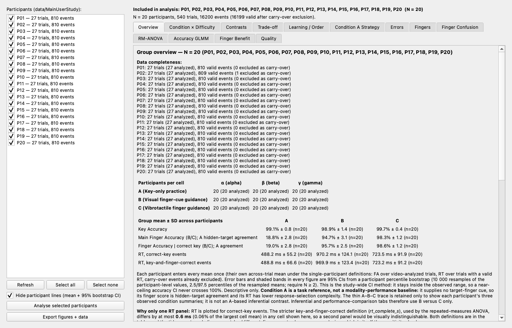

Thirteen tabs:

| Tab | Question it answers | |
|---|---|---|
| Overview | The group-level headline numbers | [screenshot](image/group_analysis_tab1-overview.png) |
| Condition × Difficulty | The factorial picture | [screenshot](image/group_analysis_tab2-condition-difficulty.png) |
| Contrasts | Paired condition contrasts | [screenshot](image/group_analysis_tab3-contrasts.png) |
| Trade-off | Descriptive speed-accuracy trade-off | [screenshot](image/group_analysis_tab4-trade-off.png) |
| Learning / order | Learning and order trends | [screenshot](image/group_analysis_tab5-learning-order.png) |
| Condition A strategy | What participants did when free to choose fingering | [screenshot](image/group_analysis_tab6-condition-a-strategy.png) |
| Errors | Event-outcome composition | [screenshot](image/group_analysis_tab7-errors.png) |
| Fingers | Homologous per-finger profiles | [screenshot](image/group_analysis_tab8-fingers.png) |
| Finger confusion | Group confusion structure | [screenshot](image/group_analysis_tab9-finger-confusion.png) |
| RM-ANOVA | The Condition × Finger repeated-measures ANOVA | [screenshot](image/group_analysis_tab10-rm-anova.png) |
| Accuracy GLMM | The accuracy sensitivity analysis | [screenshot](image/group_analysis_tab11-accuracy-glmm.png) |
| Finger benefit | Compensation / equalisation / weakest-finger analyses | [screenshot](image/group_analysis_tab12-finger-benefit.png) |
| Quality | The data-quality audit | [screenshot](image/group_analysis_tab13-quality.png) |

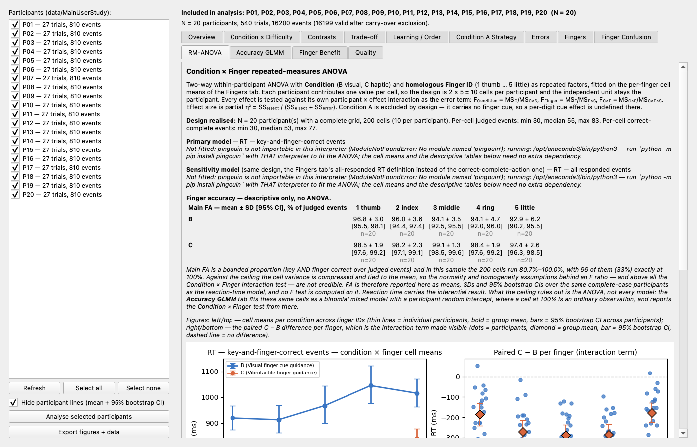

All of it reads the reviewed-and-exported `<participant>_{trials,events}.csv`
files, using the same final verdicts and validity rules as the
single-participant window — so the two can never disagree.

### 7.4 Computational Model Analysis

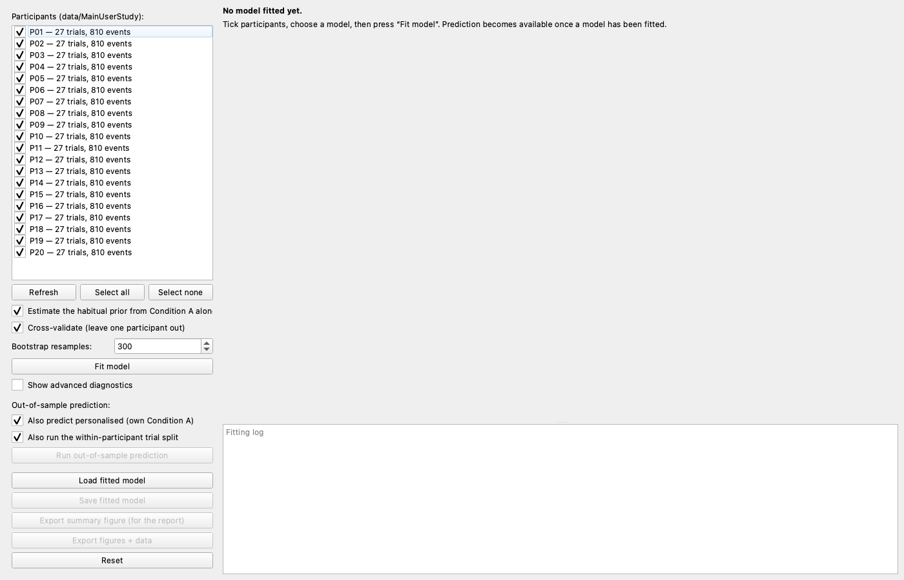

A model of **which finger acted**, fitted to the study's events and then made
to predict events it has never seen. The other two windows describe what
happened; this one asks whether one mechanism accounts for it, and whether
that mechanism generalises to a participant the model has not met.

1. **Select all** (or tick a subset of participants) and press **Fit model**.
   The two tick boxes above it are part of the fit: *Estimate the habitual
   prior from Condition A alone*, and *Cross-validate (leave one participant
   out)* — the latter refits once per held-out participant, which is most of
   why this takes **tens of minutes** on a full set. The window stays open
   alongside other tools for exactly that reason.
2. **Run out-of-sample prediction** becomes available once a fit exists, and
   fills the third panel. Its own tick boxes add the personalised prediction
   (from that participant's own Condition A) and the within-participant trial
   split.
3. **Save fitted model** / **Load fitted model** let you come back to a fit
   without repeating it. **Reset** clears the state.
4. **Export summary figure** and **Export figures + data** write to
   `data/MainUserStudy/model_figures/`.

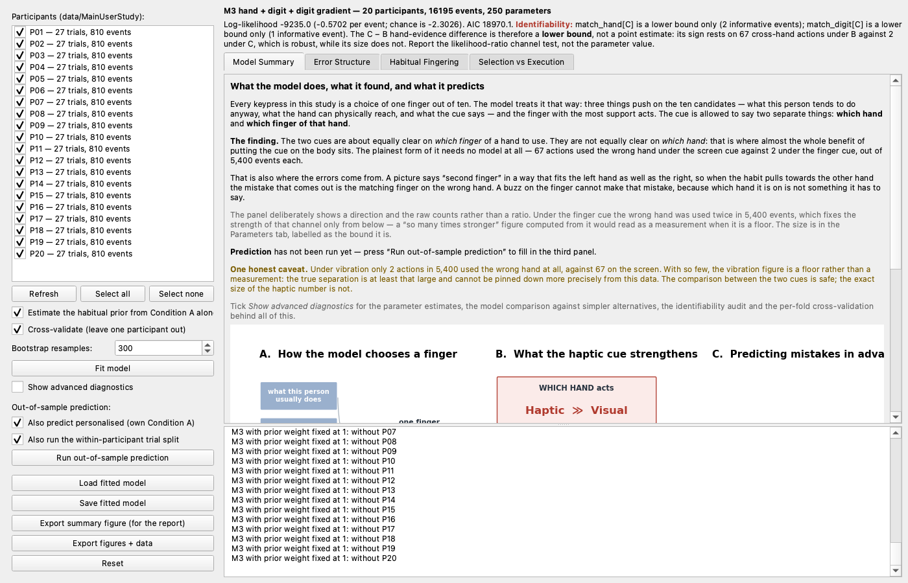

The header line is the fit's identity — model, participants, events,
parameters — followed by its log-likelihood and, in red, the **identifiability
note**: which parameters the data can only bound rather than estimate. That
note is the first thing to read, because it says which numbers in the tabs
below are point estimates and which are floors.

| Tab | Contents | |
|---|---|---|
| Model Summary | What the model does, what it found, and what it predicts, in prose — plus the three summary panels | [screenshot](image/computational_model_tab1-model-summary.png) |
| Error Structure | Where the errors come from, and which cue makes which mistake possible | [screenshot](image/computational_model_tab2-error-structure.png) |
| Habitual Fingering | The Condition-A habitual prior | [screenshot](image/computational_model_tab3-habitual-fingering.png) |
| Selection vs Execution | The reaction-time decomposition | [screenshot](image/computational_model_tab4-selection-vs-execution.png) |

Tick **Show advanced diagnostics** to add the parameter estimates, the model
comparison against simpler alternatives, the identifiability audit and the
per-fold cross-validation behind all of it. The log pane at the bottom names
each fold as it runs, so a long fit visibly progresses.

---

## 8. Tele-training

Guidance delivered over a network: a teacher plays, a relay forwards, and the
student's LED strip and finger motors fire from what the teacher did.

This is the one section whose buttons start **separate processes**, because a
teacher, a student and a relay have to be up at the same time, on different
machines, holding different devices. Nothing in the launcher closes them.

There is deliberately **no shared settings window** — each of the three
programs owns its own settings, because one window showing all three roles'
devices meant everyone was mostly looking at settings that were not theirs.

The full module documentation is [`doc/REMOTE_GUIDANCE.md`](REMOTE_GUIDANCE.md)
(§12 is the user-facing reference), and the relay has its own operator guide
in [`doc/server.md`](server.md).

### 8.1 Trying it on one machine

```bash
python -m server --init      # once: create the SQLite database
```

Then start **Relay Server**, **Teacher Client** and **Student Client** from
this section, in that order. Both clients arrive pre-filled with
`http://127.0.0.1:18765` and their demo account, so the sequence is:
sign in → create/join a room → **Get ready** → **Ready for guidance** →
**Start teaching**.

### 8.2 Relay Server

Starts the FastAPI relay (REST + WebSocket, SQLite, JWT auth) in its own
process, with its own window. If a relay is already answering on that
address, the launcher says so rather than starting a second one that would
fail to bind the port.

`server/` imports nothing from this platform, so it can be copied to a remote
host on its own.

### 8.3 Teacher Client

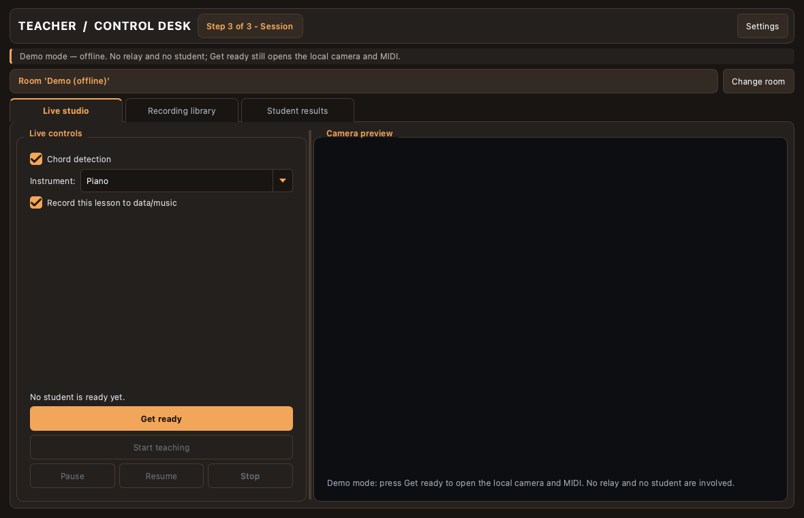

The teacher's control desk. The header tracks which of the three setup steps
you are on, **Settings** holds this machine's own camera / MIDI / profile /
serial ports, and the session page has three tabs:

| Tab | Contents |
|---|---|
| Live studio | Live controls, camera preview, and the Get ready → Start teaching flow |
| Recording library | Pre-recorded sequences to upload and trigger |
| Student results | What came back from the student |

**Chord detection** matches simultaneous notes together; **Record this lesson**
saves the session under `data/music/`. **Get ready** opens the local camera
and MIDI, **Start teaching** begins sending guidance, and Pause / Resume /
Stop control it from there.

Standalone: `python teacher_remote_guidance.py`

### 8.4 Student Client

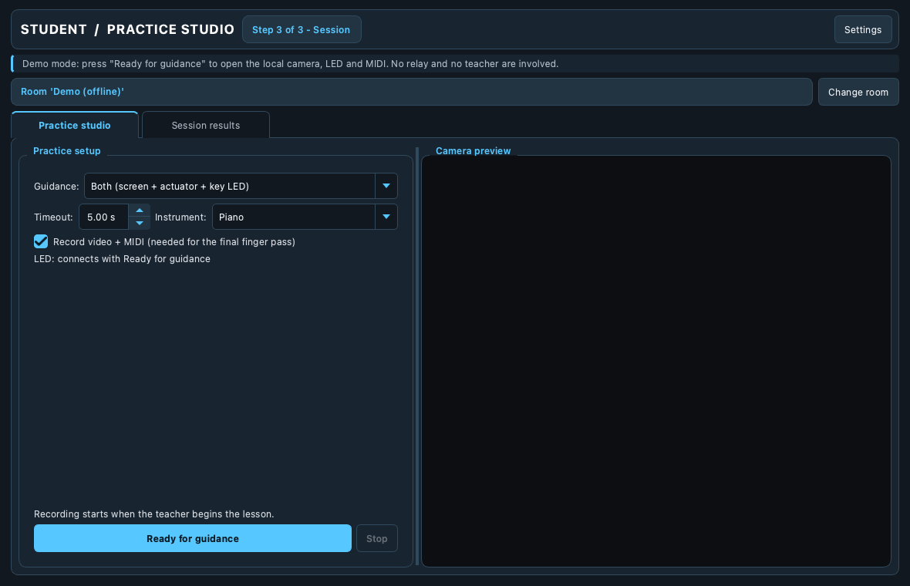

Receives the teacher's key/finger guidance and cues it locally on the
student's own LED strip and finger motors. Its **Settings** dialog is where a
remote student picks their camera, MIDI port and keyboard profile — including
**Preview keyboard profile**, which here opens the camera for one snapshot
because the window holds no camera yet.

Standalone: `python student_remote_guidance.py`

### 8.5 Tele-training Setup Wizard

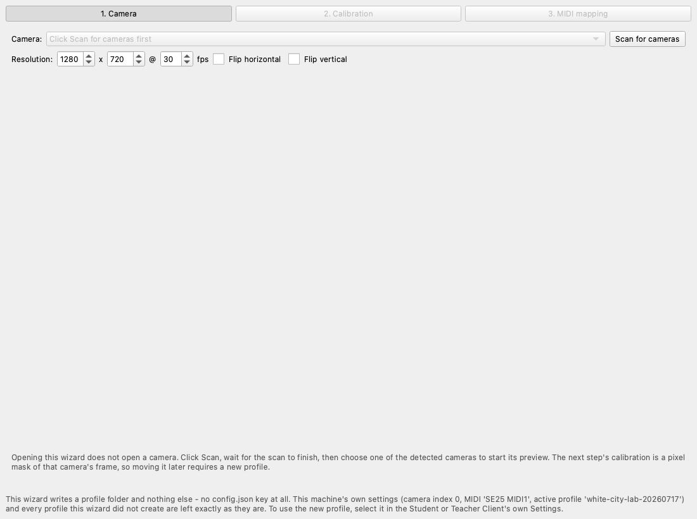

**Use this — not the section 1 wizards — to onboard a remote partner.**

A new person joining a session needs a calibration: a pixel mask of their
camera's view of their keyboard, plus that keyboard's key→note mapping. The
Initial Setup wizards produce exactly that, but they *also* write
`config.json`'s top-level `camera`, `midi.port_name` and
`active_keyboard_profile`, and save over an existing profile folder. On a
machine that also runs the formal experiment, that repoints the experiment's
devices and can destroy a calibration a recorded session is scored against.

This wizard produces the profile and **nothing else** — it writes no
`config.json` key at all, not even the `remote_guidance` block. Three steps
across the top:

1. **Camera** — press **Scan for cameras**, pick one, set resolution/fps and
   the flips. Opening the wizard does not open a camera.
2. **Calibration** — the same click-to-fill calibration as section 1.3, into a
   new profile folder.
3. **MIDI mapping** — the same key-by-key mapping as section 1.4.

The new profile is picked up by selecting it in a client's own **Settings**
dialog, which is where choosing devices already lives.

### 8.6 Network Latency Benchmark

Fires synthetic probes along the relayed path to characterise it, and writes
`samples.csv`, `summary.json` and `latency.png` under
`data/remote_guidance/latency/<run>/`. Runs as its own process, with a CLI or
a GUI.

Standalone: `python remote_latency_benchmark.py [--gui]`

### 8.7 Remote Latency Analysis

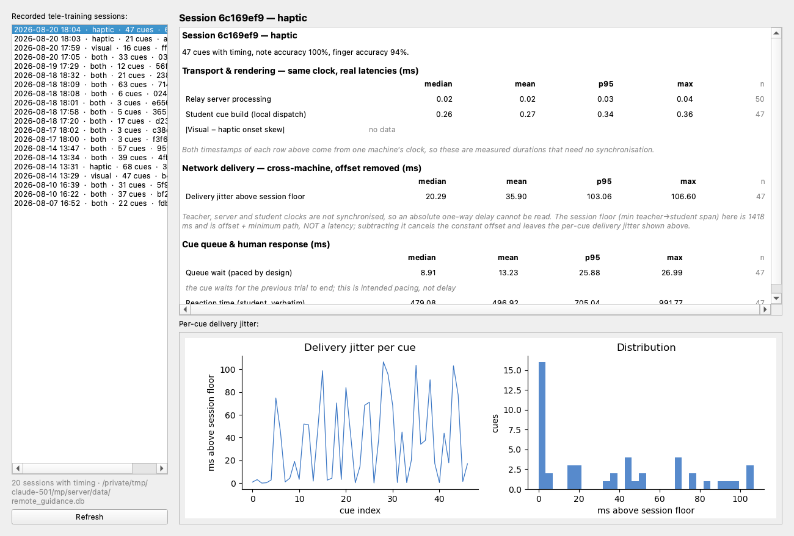

The other half of the pair: where the benchmark fires synthetic probes, this
reads the delays that **real guidance cues actually met**. It opens the
relay's own store (`server/data`), lists the sessions that recorded per-cue
timings, and shows the transport and cue-delivery breakdown for the session
you pick.

One rule shapes the layout, and it is worth knowing before reading a number
off it: **same-clock differences are latencies** and are shown as such (relay
processing, the student's cue pipeline, the visual–haptic skew), while the
cross-machine leg has no synchronised clock behind it, so only its
offset-removed variation — the delivery jitter above the session's own floor
— is reported. There is deliberately no absolute one-way number.

---

## 9. Tools

Housekeeping on data that has already been collected. Neither tool is part of
running a session or analysing one, and neither reads anything the experiment
reads.

Both windows keep running when you open another launcher tool — a conversion
pass is minutes of work and should not be thrown away by a button press.

Each window has a console twin that does exactly the same thing to the same
files: **Scan** is the script's first phase, and **Convert** / **Create
archives** is what answering `1` at its prompt does. The windows add only what
a terminal cannot: a table of what was found, an overall and a per-file
progress bar, a running log, and a **Stop** button.

### Where ffmpeg and 7z come from

Neither program is a Python dependency. Both windows look in two places, in
order:

1. **`runtime/bin/`** — drop `ffmpeg` / `7z` in that folder and nothing has to
   be installed on the machine.
2. **`PATH`**, as installed system-wide.

Each window shows which copy it is using, or a warning naming `runtime/bin` if
it found none, and has a **Re-check** button so a program dropped in there is
picked up without restarting the launcher.

### 9.1 Review Video Compression (ffmpeg)

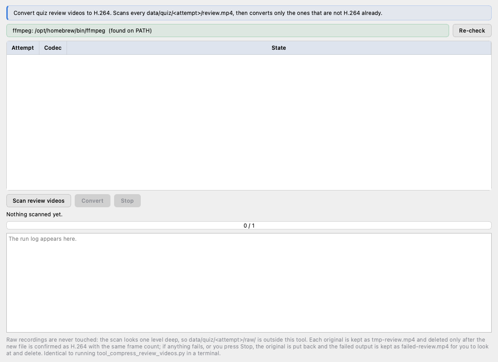

Converts `data/quiz/<attempt>/review.mp4` files that are not already H.264.

1. **Scan review videos** probes every review copy with ffmpeg and reports its
   codec. This only reads.
2. **Convert** re-encodes the ones that need it. **Stop** aborts safely.

The path pattern cannot enter `data/quiz/<attempt>/raw/`, so the original
recordings are outside this tool's scope entirely.

Each conversion pays for its safety twice over: the original is fully decoded
before the rename and the new file fully decoded after it, and the source is
deleted only once the replacement is proved non-empty, H.264, fully decodable
and the same frame count. If anything fails — including you pressing Stop —
the original is put back and the discarded output is kept as
`failed-review.mp4` for you to look at. That is three ffmpeg passes per file,
which is why there is a per-file bar as well as an overall one, and why a
study's worth of reviews is an hour-scale job.

Console twin: `python3 tool_compress_review_videos.py`

### 9.2 Participant ZIP Backup (7z)

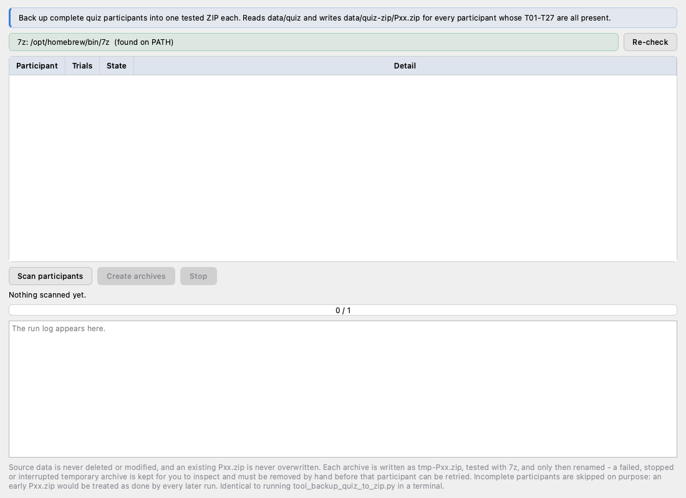

Creates one `data/quiz-zip/Pxx.zip` per complete participant.

The **table is the preview**, one row per participant, and its **State**
column is the reason that participant is or is not being archived — which
between sessions is usually the question being asked:

| State | Meaning |
|---|---|
| ready | All 27 trials present; will be archived |
| incomplete | Missing trials, named in the row |
| archive exists | `Pxx.zip` already there; skipped |
| temporary archive exists | A previous run left `tmp-Pxx.zip`; remove it by hand to retry |

Only `P01`–`P20` with trials `T01`–`T27` are eligible; `TEST-*`, `remote-*`,
other unexpected names, symlinks in place of trial directories and `.DS_Store`
files at every depth are excluded. Each archive is written first as
`tmp-Pxx.zip` and must pass `7z t` before it is renamed. Nothing existing is
ever overwritten, and no source file is ever deleted or modified.

Console twin: `python3 tool_backup_quiz_to_zip.py`

---

## 10. Validation Experiments

Small hardware-characterisation sweeps, kept separate from the study
protocols. They are what the platform's design constants were measured with.

Each window is a **front panel** wrapped around the unchanged script under
`validation_experiments/`, run on a worker thread so the GUI never freezes
during a multi-minute serial sweep. Every experiment has a full write-up in
its own folder's `README.md`; the shared metric/raw-data layer is documented
in [`doc/validation-experiments.md`](validation-experiments.md).

### The controls, which are the same in all five

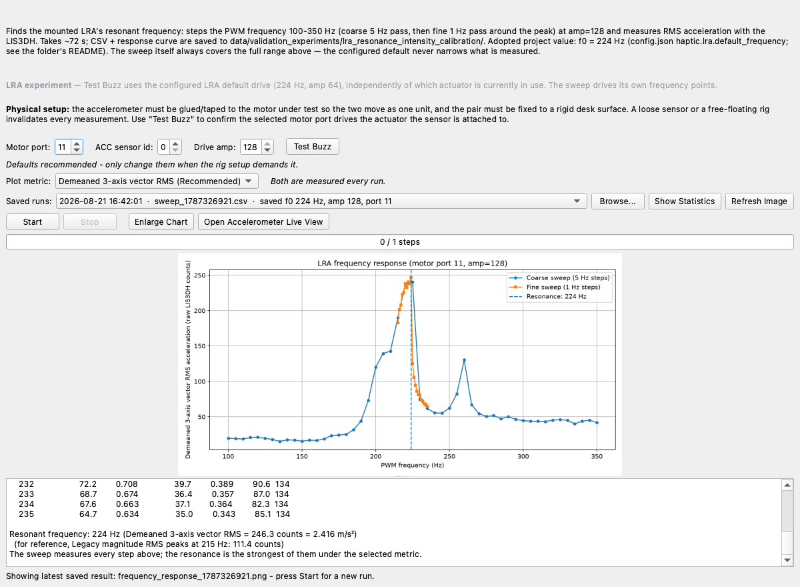

| Control | What it does |
|---|---|
| **Motor port** / **ACC sensor id** | Which actuator is driven and which accelerometer is read. The defaults are recommended — change them only when the rig demands it. |
| **Test Buzz** | Drives the selected port at the configured default so you can confirm the port really is the actuator the sensor is taped to. |
| **Plot metric** | Demeaned 3-axis vector RMS (recommended) or the legacy magnitude RMS. **Both are measured every run**, so switching this re-plots the displayed run with no new hardware pass — peak, annotations and colour-bar label all follow the choice. A run saved before raw three-axis samples were kept offers the legacy metric only, and the vector option is disabled rather than faked. |
| **Saved runs** / **Browse…** | On open the preview shows the latest saved run. Any saved CSV can be re-rendered — to a temp file, so saved outputs are never modified. |
| **Start** / **Stop** | Runs the sweep. Progress is shown as steps, with a live console log. |
| **Enlarge Chart** | The in-window preview is a thumbnail. Clicking it opens the PNG at full resolution with fit / 100% / zoom, Ctrl+scroll and panning. **One** such window is shared by every validation experiment — clicking a chart in another window swaps the image instead of piling up windows. |
| **Show Statistics** | The console-style text statistics for the loaded run. |

> **Physical setup matters more than any setting here.** The accelerometer
> must be glued or taped to the motor under test so the two move as one unit,
> and the pair fixed to a rigid desk surface. A loose sensor or a
> free-floating rig invalidates every measurement.

Runs are saved as timestamped CSV / PNG / `raw_acc.npz` / `meta.json` sets
under `data/validation_experiments/<experiment>/`. The `raw_acc.npz` holds the
run's full three-axis samples, so both intensity metrics and every chart can
be regenerated offline.

### 10.1 Actuator Spectrogram (ERM/LRA)

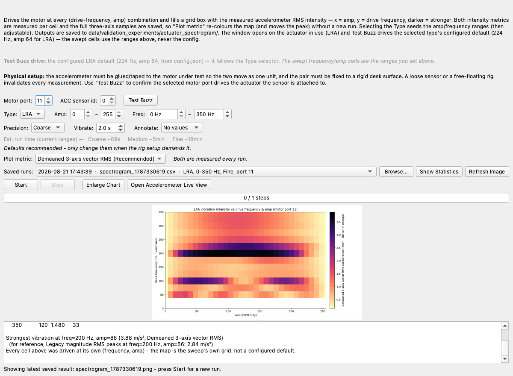

A 2-D drive-frequency × amplitude intensity map — where in that plane the
actuator actually produces vibration.

### 10.2 LRA Frequency Sweep (Resonance)

*(Pictured in the section above.)* Finds the mounted LRA's resonant frequency:
a coarse 5 Hz pass over 100–350 Hz, then a fine 1 Hz pass around the peak. This is the measurement
behind `config.json`'s `haptic.lra.default_frequency`. The sweep always covers
the full range — the configured default never narrows what is measured.

### 10.3 LRA Amplitude Sweep (Intensity)

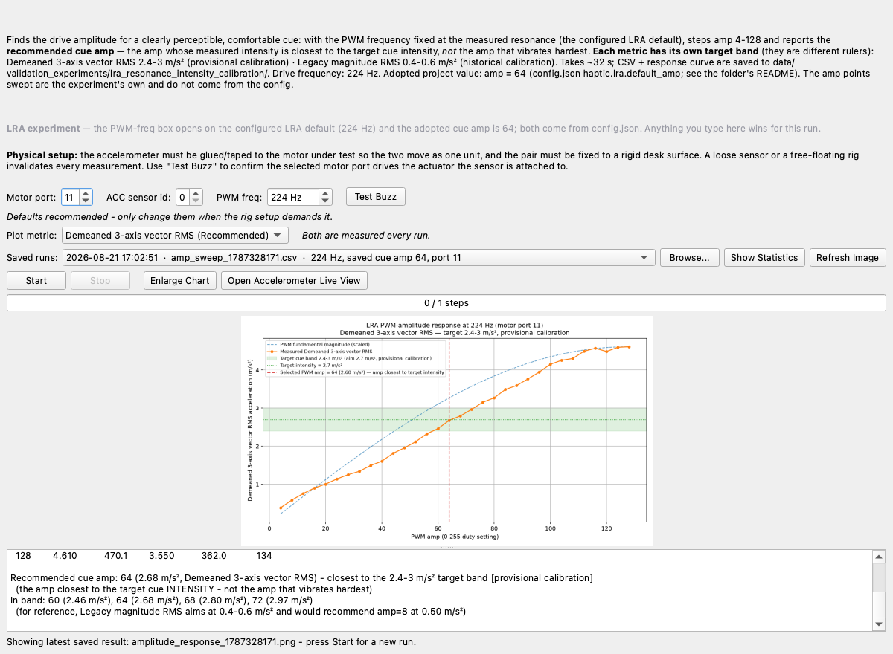

Vibration intensity against drive amp at a fixed frequency — the measurement
behind `haptic.lra.default_amp`.

### 10.4 Motor → ACC Delay (LRA/ERM)

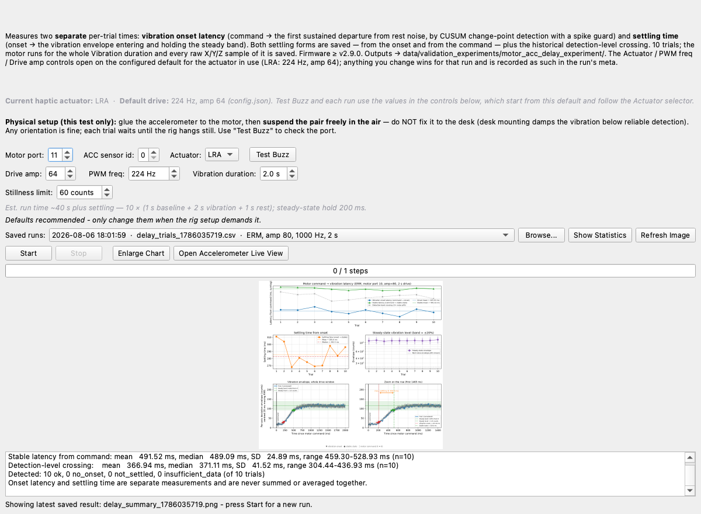

Command-to-vibration latency: how long after the drive command the
accelerometer first sees motion. Produces a four-panel summary, which is
worth opening with **Enlarge Chart** — it carries far too much detail to read
at thumbnail size.

### 10.5 Adhesion Vibration Comparison (LRA)

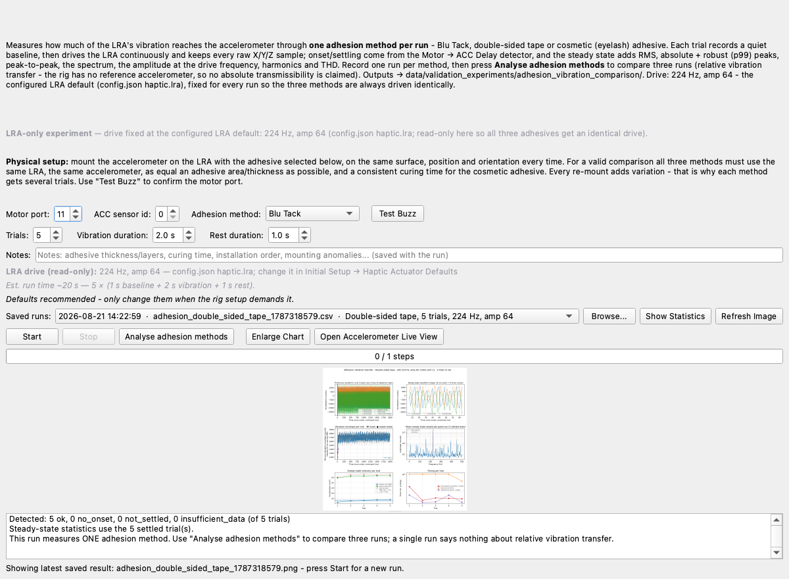

Relative vibration transfer of three mounting adhesives, LRA only, with its
own three-run comparison analysis — how much of the actuator's output
actually reaches the nail depending on what holds it there.

---

## 11. Rhythm Experiment

A **separate study**. The Main User Study asks which cue modality teaches
best; this one asks what survives when a cue is taken away. One 15-note
melody, played 19 times, with guidance withdrawn on a schedule:

    Training ×5 → Probe 1 → Training ×5 → Probe 2 → Training ×5 → Probe 3 → Final test

| Phase | Backlight | Haptic | Task | n |
|---|---|---|---|---|
| Training | on | on | cue/response | 15 |
| Probe | on | off | performance | 3 |
| Final test | off | off | performance | 1 |

The design, the measures and the analysis plan are written up in
[`doc/RHYTHM_EXPERIMENT.md`](RHYTHM_EXPERIMENT.md); the generator has its own
guide in [`doc/melody-generator.md`](melody-generator.md).

> **It cannot disturb any earlier experiment**, and that is structural rather
> than a convention: this section shares no code with the sequence generator,
> writes no `config.json` key, no keyboard profile, and nothing under
> `data/sequence/`, `data/music/` or `data/MainUserStudy/`. Its melodies are
> not registered with the song library, so one can never appear in the song
> pickers used by the other studies. The two studies meet only in the shared
> `data/quiz/` folder, where the `rhythm-` prefix separates them.

The five buttons are in the order a session uses them.

### 11.1 Rhythm Melody Generator (15-note)

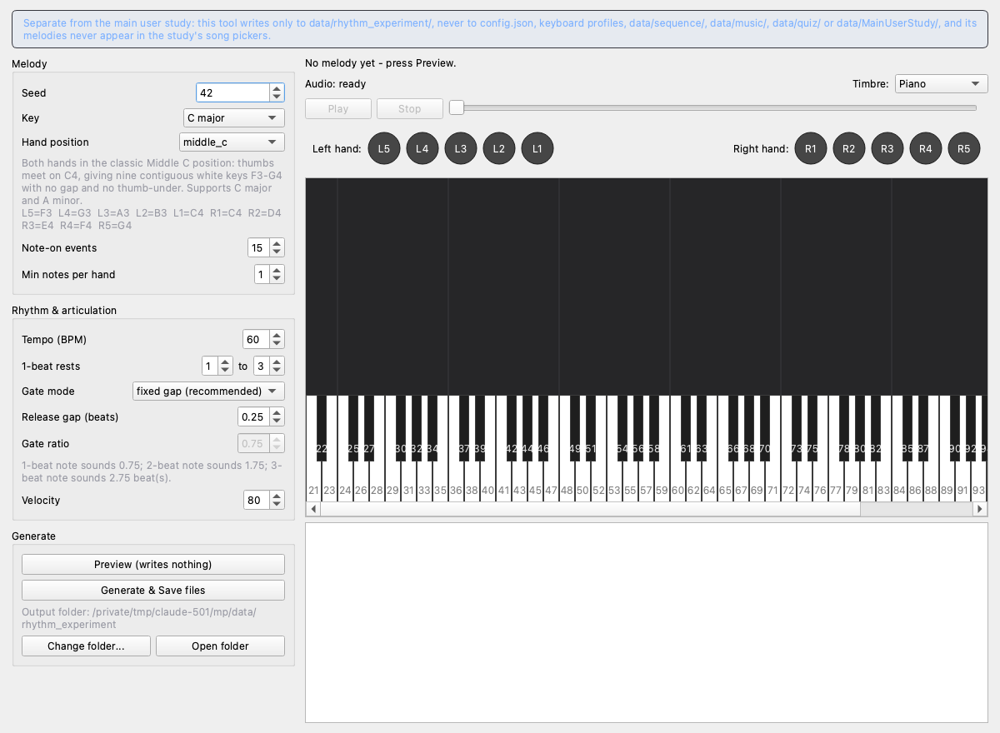

1. Pick a **seed**, a **key** and a **hand position**. The note range comes
   from the chosen five-finger hand position, not from the calibrated
   profile — so this does not care which profile is selected.
2. **Preview (writes nothing)** generates and shows the melody on the
   on-screen piano, with the target finger lit for each note. Play / Pause /
   Stop and the seek bar are the Song Playback controls, shared so a melody
   looks and sounds the same here as when it is replayed off disk.

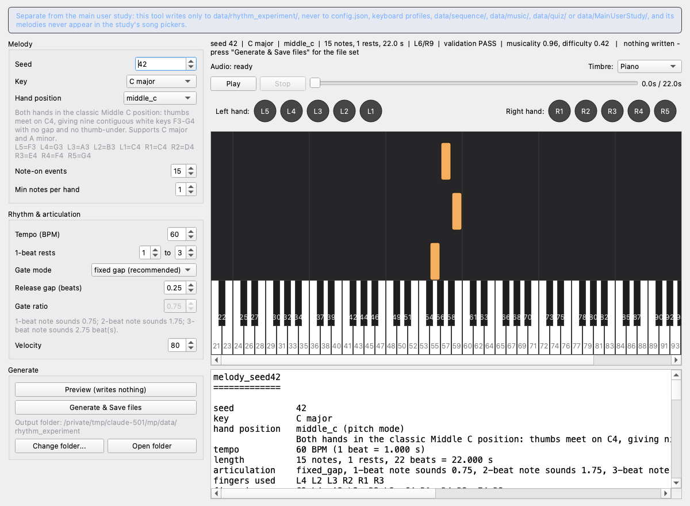

3. **Generate & Save files** writes the `.mid` / `.json` / `.csv` / `.txt`
   stimulus set into `data/rhythm_experiment/`. **Change folder…** and
   **Open folder** control where.

### 11.2 Playback Rhythm Melody

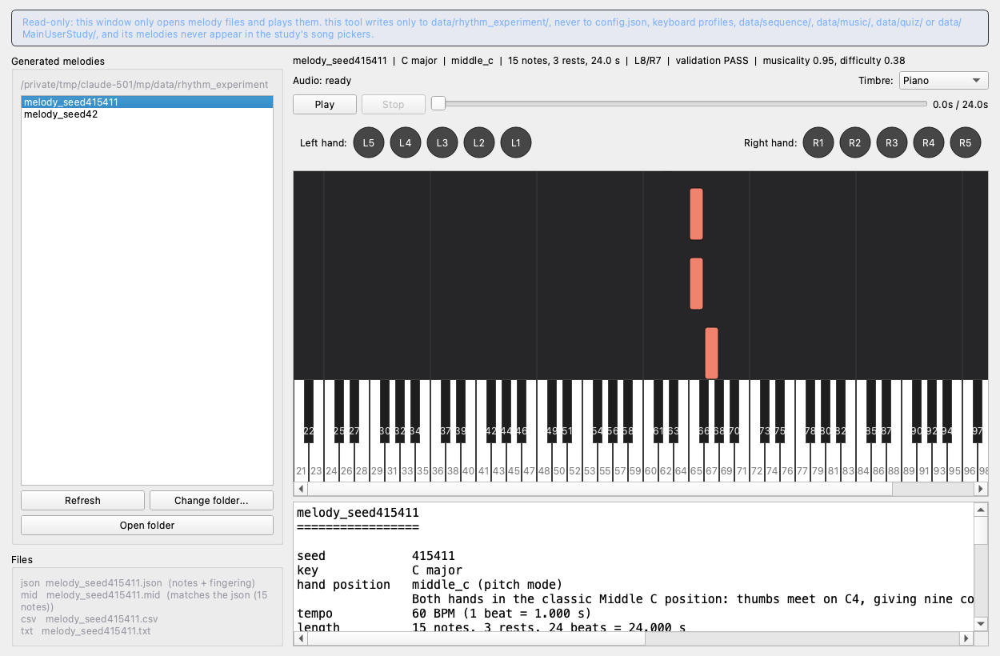

Read-only replay of what the generator already wrote: pick a melody, and it
plays on the same piano, reading the `.json` for the fingering and the exact
note-on/note-off times plus the `.mid` as a cross-check.

### 11.3 Rhythm Trial Schedule

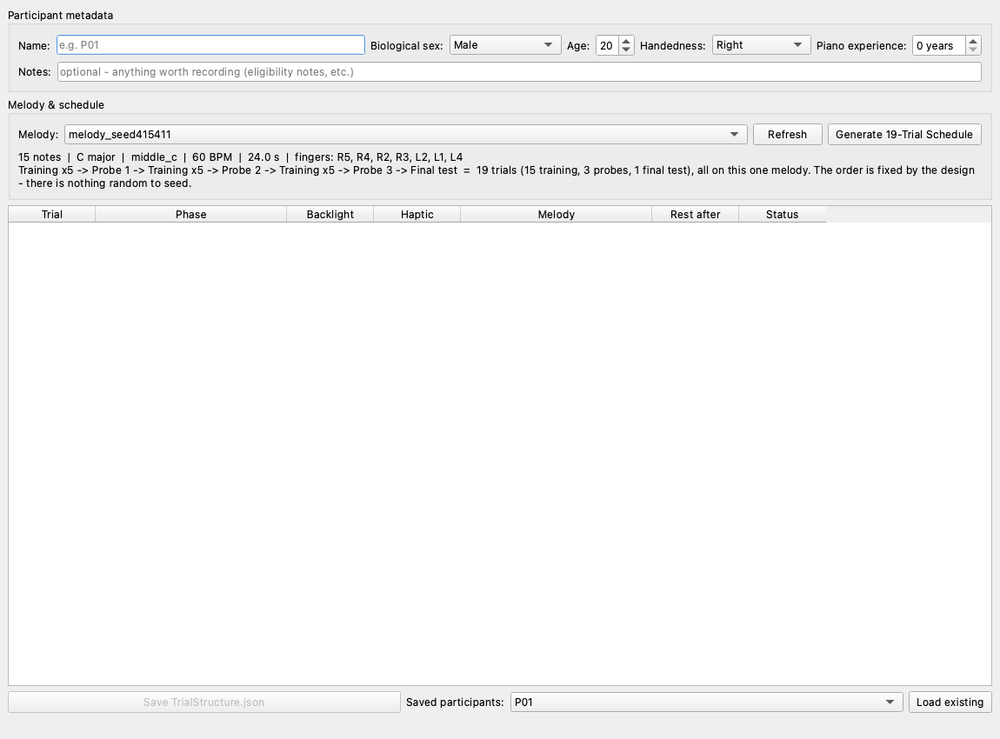

Fill in the participant's metadata, pick which melody under
`data/rhythm_experiment/` to lock them to, and **Generate 19-Trial Schedule**.

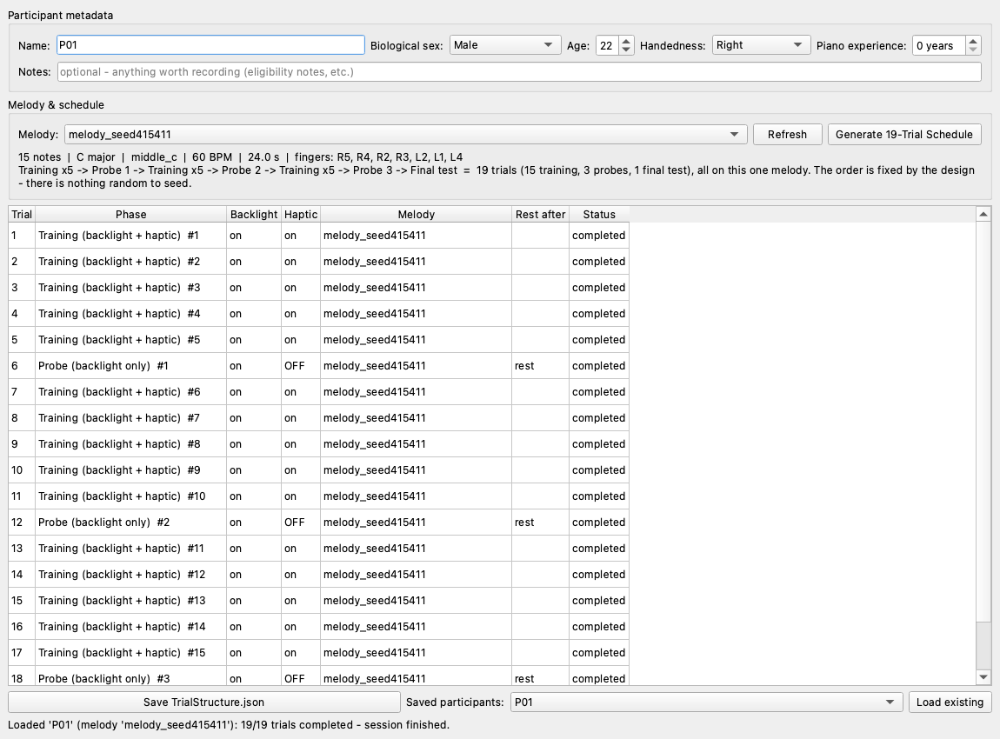

Simpler than the Main User Study's equivalent in one important way: the trial
order here is **fixed by the design**, not sampled, so there is no batch to
choose, no seed to draw and nothing to reproduce. The one real choice is which
melody the participant learns — and because they play the same one 19 times,
that choice is made once, here, and frozen into their file.

**Save TrialStructure.json** writes to
`data/RhythmStudy/<participant>/TrialStructure.json`.

### 11.4 Rhythm Experiment Session

This button opens **two** windows — the session controller and the trial
runner. There is no participant-facing cue screen, because this study has no
visual guidance: the only cues are the keyboard backlight and the haptic
motors.

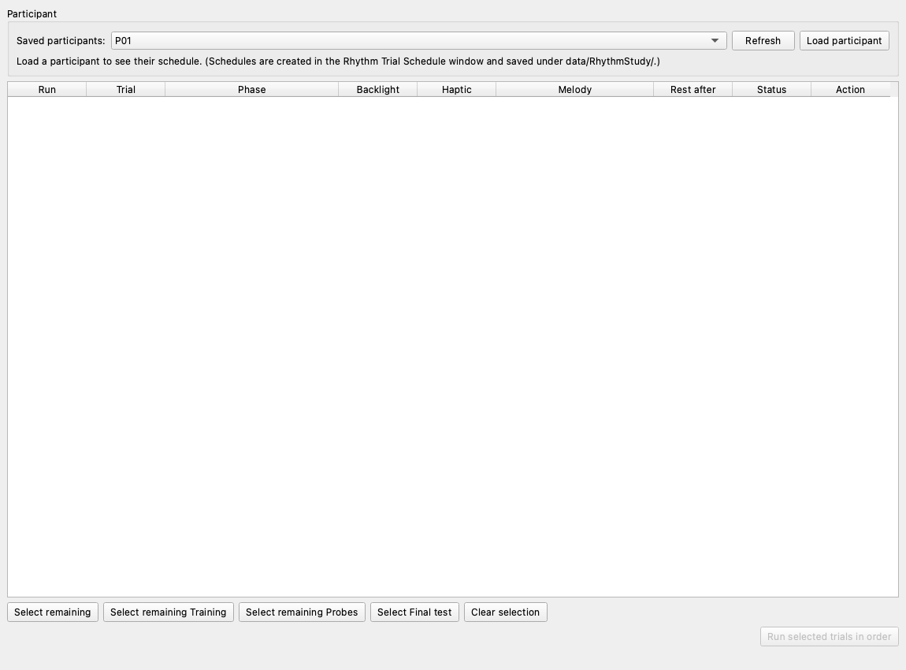

**Load participant** brings in the saved schedule and the table shows all 19
trials with their live status. Every row has a tick box and a **Start**
button; the shortcuts are phase-shaped here — **Select remaining Training**,
**Select remaining Probes**, **Select Final test** — and **Run selected trials
in order** walks the ticked trials smallest-index-first, pausing for Continue
between them.

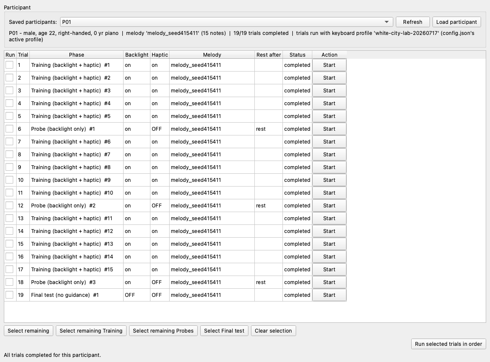

The **Backlight** and **Haptic** columns are the design made visible: `on/on`
through Training, `on/OFF` at each Probe, `OFF/OFF` for the Final test.

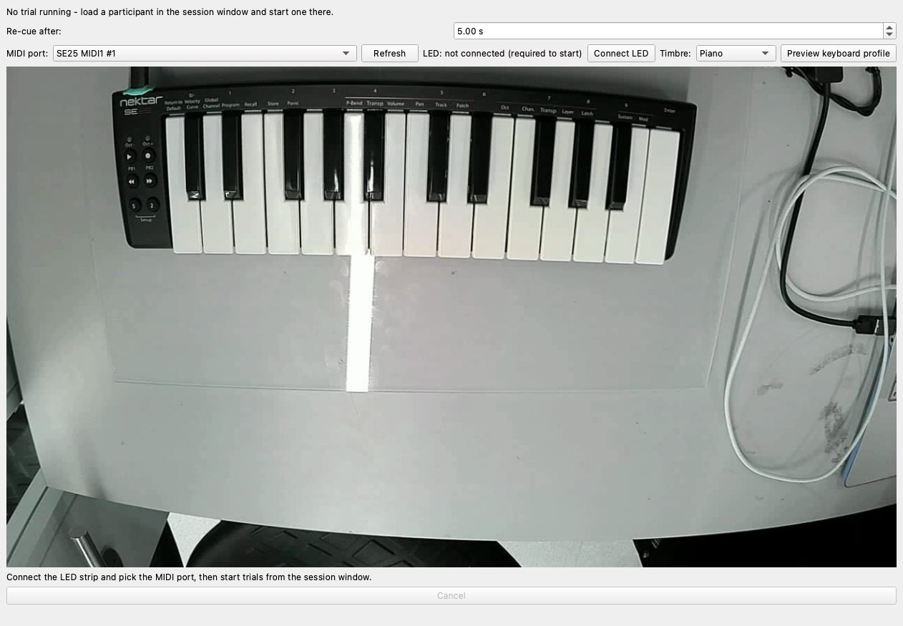

Each trial is recorded as an ordinary quiz under `data/quiz/` with a `rhythm-`
prefix, byte-compatible with any other quiz; this study's extra per-note
fields go in a sidecar file rather than into `results.json`.

### 11.5 Rhythm Group Analysis

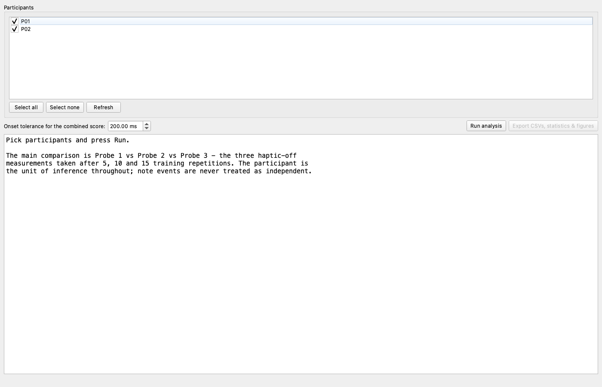

The whole analysis stage in one window — deliberately one, not the main
study's three, because this study asks one question and answers it from one
table of three probes.

1. Tick the participants (**Select all** / **Select none**).
2. Set the **onset tolerance** for the combined score (default 200 ms).
3. **Run analysis** prints the summary.

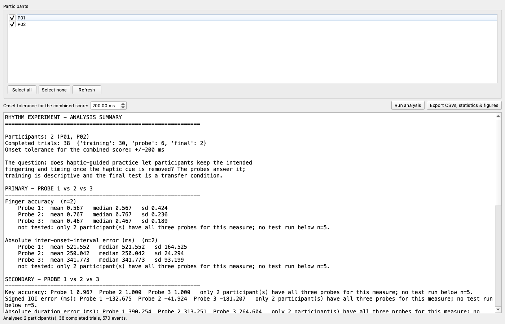

The summary states the question in plain words, then gives the primary
Probe 1 vs 2 vs 3 comparison (finger accuracy, absolute inter-onset-interval
error) and the secondary measures. It names its own limits — where a measure
has too few participants for a test, it says so instead of reporting one.

**Export CSVs, statistics & figures** writes everything under
`data/RhythmStudy/group_figures/`.

---

## 12. Demo & About

### 12.1 Demo Mode

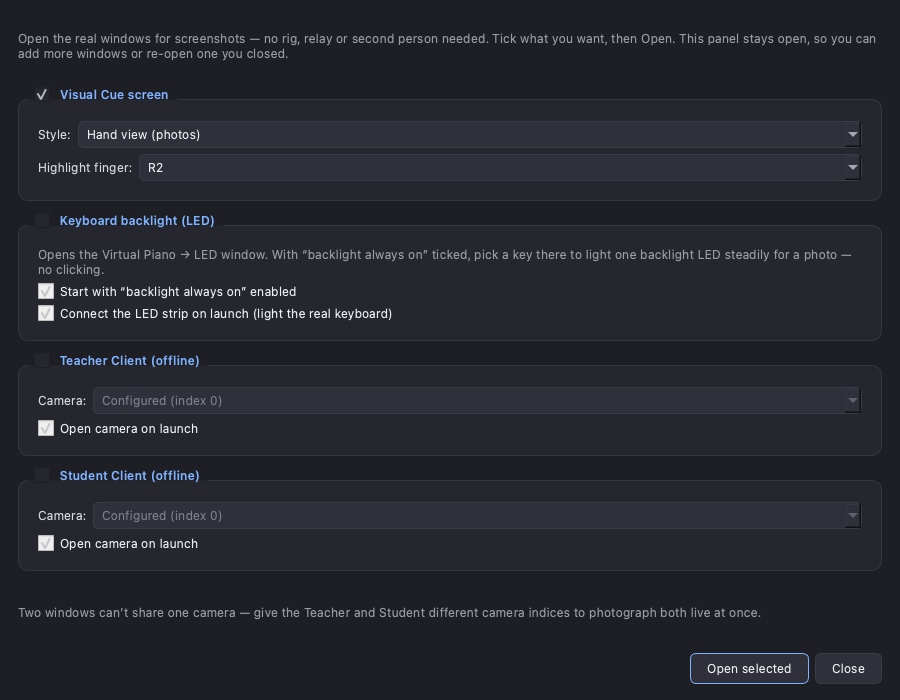

Opens the platform's participant- and tele-training-facing windows so they can
be photographed for slides, a report or a poster — with **no rig, no relay and
no second person**. It adds no behaviour of its own: each window is the real
one, shown the way it looks in use.

Tick any combination and press **Open selected**:

| Option | What opens |
|---|---|
| **Visual Cue screen** | The real finger-cue screen, with a finger you pick already highlighted, in either the dot or the hand style |
| **Keyboard backlight (LED)** | The real Virtual Piano → LED window. With "backlight always on" ticked, pick a key there to light one LED steadily for a photo — no clicking |
| **Teacher Client (offline)** | The tele-training teacher window in demo mode: straight to its session page, no server, no login, no peer |
| **Student Client (offline)** | The same for the student |

The camera and MIDI still open locally from the normal in-window buttons, so a
photo shows the live view. Two windows cannot share one camera — give the
Teacher and Student different camera indices to photograph both live at once.

The panel stays open after **Open selected**, so you can add more windows or
re-open one you closed. The windows it opens are exempt from the
one-tool-at-a-time rule — showing several at once is the whole point — and
they close with the launcher.

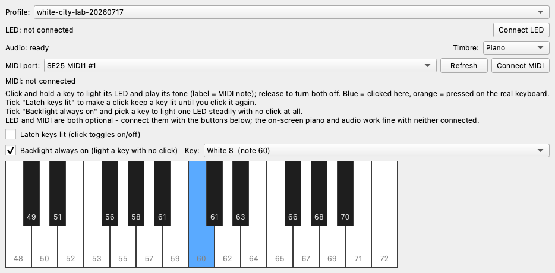

### 12.2 About

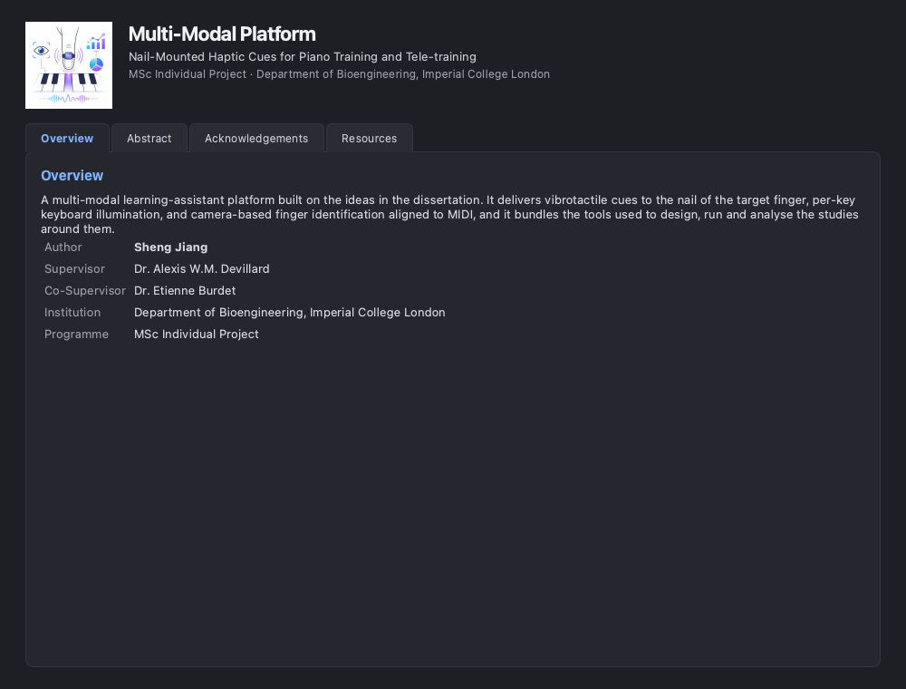

The platform's front matter, copied verbatim from the dissertation: the title
and subtitle, the author and supervisors, the abstract, the acknowledgements,
and the public repositories.

| Tab | Contents | |
|---|---|---|
| Overview | What the platform is, and who made it | [screenshot](image/about_tab1-overview.png) |
| Abstract | The dissertation abstract | [screenshot](image/about_tab2-abstract.png) |
| Acknowledgements | As written in the report | [screenshot](image/about_tab3-acknowledgements.png) |
| Resources | The two public repositories | [screenshot](image/about_tab4-resources.png) |

It claims no hardware, so it stays open beside whatever tool you are using,
and re-clicking About raises it rather than opening a second copy.

---

## Where files are written

Every path is relative to `main/`.

| Path | Written by | Contents |
|---|---|---|
| `config.json` | Sections 1.2, 1.3, 1.4, 1.6, 1.7, 2.5 | Camera, MIDI port, active profile, visual cue style, haptic defaults, accelerometer sensor id, the tele-training block |
| `data/keyboard-profile/<name>/` | Keyboard Calibration Wizard (1.3), MIDI Mapping Wizard (1.4), Tele-training Setup Wizard (8.5) | `keyboard_template.json`, `keyboard_key_map.png`, `midi_mapping.json` |
| `data/music/<song>/` | Song Recording Wizard (3.1), Teacher Client with recording on (8.3) | The recording plus its fingering-annotated score |
| `data/sequence/<batch>/` | Experiment Sequence Generator (4.1) | Generated stimulus sequences |
| `data/sequence_validation/<batch>/` | Experiment Sequence Generator (4.1) | The difficulty-validation output for a batch |
| `data/quiz/<attempt>/` | Quizzes (5.1, 5.2), Formal Experiment Session (6.2), Rhythm Experiment Session (11.4) | `raw/` video + MIDI, `results.json`, `meta.json`, `review.mp4`, and the sync anchors |
| `data/quiz-zip/Pxx.zip` | Participant ZIP Backup (9.2) | Participant-level backups; never used as live input |
| `data/MainUserStudy/<P>/` | Participant Trial Schedule (6.1), Quiz Analysis export (7.1), Participant Analysis (7.2) | `TrialStructure.json`, `<P>_trials.csv`, `<P>_events.csv`, `figures/` |
| `data/MainUserStudy/group_figures/` | Group Analysis (7.3) | Group figures and CSVs |
| `data/MainUserStudy/model_figures/` | Computational Model Analysis (7.4) | Fitted-model figures, CSVs and the prediction tables |
| `data/validation_experiments/<experiment>/` | Section 10 | Timestamped CSV / PNG / `raw_acc.npz` / `meta.json` per run |
| `data/remote_guidance/latency/<run>/` | Network Latency Benchmark (8.6) | `samples.csv`, `summary.json`, `latency.png` |
| `data/rhythm_experiment/` | Rhythm Melody Generator (11.1) | `.mid` / `.json` / `.csv` / `.txt` per melody |
| `data/RhythmStudy/<P>/` | Rhythm Trial Schedule (11.3) | `TrialStructure.json` |
| `data/RhythmStudy/group_figures/` | Rhythm Group Analysis (11.5) | Tables, statistics and figures |

---

## If something looks wrong

**The key masks no longer sit on the physical keys.** The camera or the
keyboard has moved. A profile is only a pixel mask of one camera position, so
re-run the [Keyboard Calibration Wizard](#13-keyboard-calibration-wizard).
[Keyboard Profile Selection / Region Preview](#15-keyboard-profile-selection-region-preview)
is the fastest way to check, and **Preview keyboard profile** does the same
from inside the quiz and trial-runner windows.

**Finger accuracy is unexpectedly low for one trial.** Check the alignment
before the detection: open **Video Sync** for that row in
[Quiz Analysis](#71-quiz-analysis). Per-trial camera start-up error is real,
and a mis-detected LED flash moves every event.

**Two keyboards of the same model, and the wrong one responds.** The `#1` /
`#2` suffix is enumeration order, not device identity, and it can change when
something is replugged. `python test-script/MIDI.py` listens on every port at
once and prints which label your key press arrived on.

**A launcher tool closed itself when I opened another.** That is the
one-tool-at-a-time rule — most of these claim the camera or the MIDI keyboard.
The Analysis and Tools windows are the exceptions and stay open.

**A window says it cannot find ffmpeg / 7z.** Drop the executable into
`runtime/bin/` and press **Re-check**; nothing has to be installed
system-wide.

**Group Analysis disagrees with what I corrected in Quiz Analysis.** Group
Analysis reads the exported CSVs, not `results.json`. Re-run **Export
participant data** after any round of finger corrections or carry-over
verdicts.

---

## How these screenshots were made

`main/test-script/capture_manual_screenshots.py` renders every window in this
manual offscreen and writes the PNGs to `doc/image/`. It is a documentation
tool, not a test, and it exists so the manual can be regenerated after a UI
change instead of being re-photographed by hand.

It runs against a **copy** of the project rather than the live one, with the
camera, serial ports and MIDI ports stubbed, so a capture run cannot open a
device or write to real data. See that file's docstring for how to point it at
a sandbox and re-run it.
